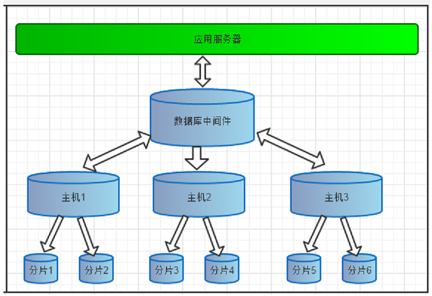
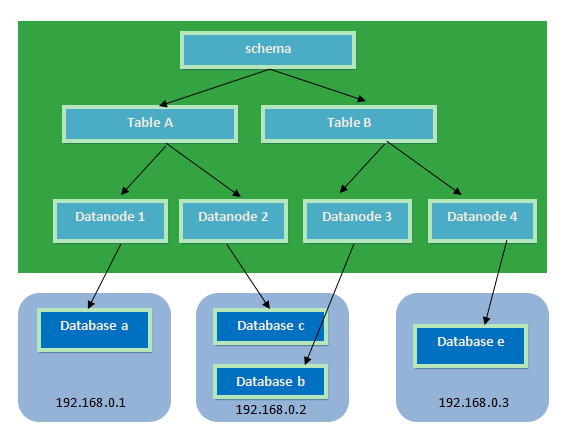
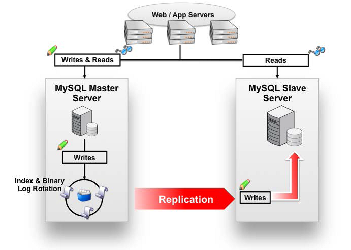
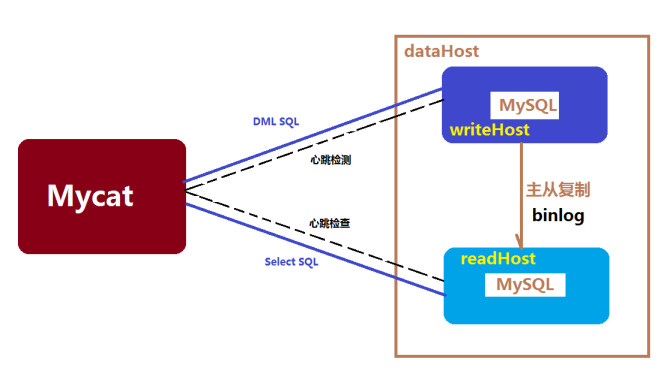

# 品优$_2 集群解决方案

## 一、开源数据库中间件-MyCat

如今随着互联网的发展，数据的量级也是撑指数的增长，从GB到TB到PB。对数据的各种操作也是愈加的困难，传统的关系性数据库已经无法满足快速查询与插入数据的需求。这个时候NoSQL的出现暂时解决了这一危机。它通过降低数据的安全性，减少对事务的支持，减少对复杂查询的支持，来获取性能上的提升。

但是，在有些场合NoSQL一些折衷是无法满足使用场景的，就比如有些使用场景是绝对要有事务与安全指标的。这个时候NoSQL肯定是无法满足的，所以还是需要使用关系性数据库。如果使用关系型数据库解决海量存储的问题呢？此时就需要做数据库集群，为了提高查询性能将一个数据库的数据分散到不同的数据库中存储。

### 1.1 MyCat简介 -- 伪装协议

Mycat 背后是阿里曾经开源的知名产品——Cobar。Cobar 的核心功能和优势是 MySQL 数据库分片，此产品曾经广为流传，据说最早的发起者对 Mysql 很精通，后来从阿里跳槽了，阿里随后开源的 Cobar，并维持到 2013 年年初，然后，就没有然后了。 

Cobar 的思路和实现路径的确不错。基于 Java 开发的，实现了 MySQL 公开的二进制传输协议，巧妙地将自己伪装成一个 MySQL Server，目前市面上绝大多数 MySQL 客户端工具和应用都能兼容。比自己实现一个新的数据库协议要明智的多，因为生态环境在哪里摆着。 

Mycat 是基于 cobar 演变而来，对 cobar 的代码进行了彻底的重构，使用 NIO 重构了网络模块，并且优化了 Buffer 内核，增强了聚合，Join 等基本特性，同时兼容绝大多数数据库成为通用的数据库中间件。



### 1.2、MyCat下载及安装

#### 第1步： 安装MySql  (当然一定先要有jdk)

```shell
#　上传mysql rpm 文件到linux
$ sftp> put d:/my-developer/mysql-package/MySQL-client-5.6.43-1.el6.x86_64.rpm
$ sftp> put d:/my-developer/mysql-package/MySQL-server-5.6.43-1.el6.x86_64.rpm

# 安装
$ rpm -ivh MySQL-server-5.6.43-1.el6.x86_64.rpm
$ rpm -ivh MySQL-client-5.6.43-1.el6.x86_64.rpm
```

```shell
# （8）设置远程登录权限
$ MYSQL> GRANT ALL PRIVILEGES ON *.* TO 'root'@'%'IDENTIFIED BY '123456'  WITH GRANT OPTION;
```

#### 第2步：MyCat安装及启动

MyCat的官方网站：<http://www.mycat.org.cn/>

下载地址：<https://github.com/MyCATApache/Mycat-download>

第一步：将Mycat-server-1.4-release-20151019230038-linux.tar.gz上传至服务器

第二步：将压缩包解压缩。建议将mycat放到/usr/local/mycat目录下。

第三步：进入mycat目录的bin目录，启动mycat

mycat 支持的命令{ console | start | stop | restart | status | dump } 

Mycat的默认端口号为：8066


### 1.3MyCat分片-海量数据存储解决方案

### 1.3.1 什么是分片

简单来说，就是指通过某种特定的条件，将我们存放在同一个数据库中的数据分散存放到多个数据库（主机）上面，以达到分散单台设备负载的效果。 

数据的切分（Sharding）根据其切分规则的类型，可以分为两种切分模式。

   （1）一种是按照不同的表（或者Schema）来切分到不同的数据库（主机）之上，这种切分可以称之为数据的垂直（纵向）切分

   （2）另外一种则是根据表中的数据的逻辑关系，将同一个表中的数据按照某种条件拆分到多台数据库（主机）上面，这种切分称之为数据的水平（横向）切分。

##### Mycat 分片策略：



**逻辑库(schema)** **：**

前面一节讲了数据库中间件，通常对实际应用来说，并不需要知道中间件的存在，业务开发人员只需要知道数据库的概念，所以数据库中间件可以被看做是一个或多个数据库集群构成的逻辑库。

**逻辑表（table**）：

既然有逻辑库，那么就会有逻辑表，分布式数据库中，对应用来说，读写数据的表就是逻辑表。逻辑表，可以是数据切分后，分布在一个或多个分片库中，也可以不做数据切分，不分片，只有一个表构成。

分片表：是指那些原有的很大数据的表，需要切分到多个数据库的表，这样，每个分片都有一部分数据，所有分片构成了完整的数据。 总而言之就是需要进行分片的表。

非分片表：一个数据库中并不是所有的表都很大，某些表是可以不用进行切分的，非分片是相对分片表来说的，就是那些不需要进行数据切分的表。 

**分片节点(dataNode)**

数据切分后，一个大表被分到不同的分片数据库上面，每个表分片所在的数据库就是分片节点（dataNode）。

**节点主机(dataHost)** 

数据切分后，每个分片节点（dataNode）不一定都会独占一台机器，同一机器上面可以有多个分片数据库，这样一个或多个分片节点（dataNode）所在的机器就是节点主机（dataHost）,为了规避单节点主机并发数限制，尽量将读写压力高的分片节点（dataNode）均衡的放在不同的节点主机（dataHost）。

**分片规则(rule)** 

前面讲了数据切分，一个大表被分成若干个分片表，就需要一定的规则，这样按照某种业务规则把数据分到某个分片的规则就是分片规则，数据切分选择合适的分片规则非常重要，将极大的避免后续数据处理的难度。


### 1.3.2 MyCat分片配置 

**（1）配置schema.xml** 

schema.xml作为MyCat中重要的配置文件之一，管理着MyCat的逻辑库、逻辑表以及对应的分片规则、DataNode以及DataSource。弄懂这些配置，是正确使用MyCat的前提。这里就一层层对该文件进行解析。

schema 标签用于定义MyCat实例中的逻辑库

Table 标签定义了MyCat中的逻辑表  rule用于指定分片规则，auto-sharding-long的分片规则是按ID值的范围进行分片 1-5000000 为第1片  5000001-10000000 为第2片....  具体设置我们会在第5小节中讲解。

dataNode 标签定义了MyCat中的数据节点，也就是我们通常说所的数据分片。

dataHost标签在mycat逻辑库中也是作为最底层的标签存在，直接定义了具体的数据库实例、读写分离配置和心跳语句。

在服务器上创建3个数据库，分别是db1   db2   db3

修改schema.xml如下：

```xml
<?xml version="1.0"?>
<!DOCTYPE mycat:schema SYSTEM "schema.dtd">
<mycat:schema xmlns:mycat="http://org.opencloudb/">
	<schema name="PINYOUGOUDB" checkSQLschema="false" sqlMaxLimit="100">
		<table name="tb_test" dataNode="dn1,dn2,dn3" rule="auto-sharding-long" />
	</schema>
	<dataNode name="dn1" dataHost="localhost1" database="db1" />
	<dataNode name="dn2" dataHost="localhost1" database="db2" />
	<dataNode name="dn3" dataHost="localhost1" database="db3" />
	<dataHost name="localhost1" maxCon="1000" minCon="10" balance="0"
		writeType="0" dbType="mysql" dbDriver="native" switchType="1"  slaveThreshold="100">
		<heartbeat>select user()</heartbeat><!--心跳测试，判断数据库是否能连接-->
		<writeHost host="hostM1" url="192.168.25.142:3306" user="root"
			password="123456">
		</writeHost>
	</dataHost>	
</mycat:schema>
```

**（2）配置 server.xml** 

server.xml几乎保存了所有mycat需要的系统配置信息。最常用的是在此配置用户名、密码及权限。在system中添加UTF-8字符集设置，否则存储中文会出现问号。

```xml
<?xml version="1.0" encoding="UTF-8"?>
<!DOCTYPE mycat:server SYSTEM "server.dtd">
<mycat:server xmlns:mycat="http://org.opencloudb/">
	<system>
	<property name="defaultSqlParser">druidparser</property>
	<property name="charset">utf8</property>
    
	</system>
	<user name="test">
		<property name="password">test</property>
		<property name="schemas">PINYOUGOUDB</property>
	</user>

	<user name="root">
		<property name="password">123456</property>
		<property name="schemas">PINYOUGOUDB</property>
		<property name="readOnly">false</property>
	</user
</mycat:server>
```


### 1.3.3 MyCat分片规则

rule.xml用于定义分片规则  ，我们这里讲解两种最常见的分片规则:

#### （1）按主键范围分片rang-long

conf/ruler.xml 在配置文件中我们找到

```xml
	<tableRule name="auto-sharding-long">
		<rule>
			<columns>id</columns>
			<algorithm>rang-long</algorithm>
		</rule>
	</tableRule>
```

tableRule 是定义具体某个表或某一类表的分片规则名称   columns用于定义分片的列  algorithm代表算法名称    我们接着找rang-long的定义 

```xml
<function name="rang-long"  class="org.opencloudb.route.function.AutoPartitionByLong">          	<property name="mapFile">autopartition-long.txt</property>
</function> 
```

   Function用于定义算法 mapFile 用于定义算法需要的数据，我们打开autopartition-long.txt 

```
# range start-end ,data node index
# K=1000,M=10000.
0-500M=0
500M-1000M=1
1000M-1500M=2
```

#### （2）一致性哈希murmur

当我们需要将数据平均分在几个分区中，需要使用一致性hash规则

我们找到function的name为murmur 的定义，将count属性改为3，因为我要将数据分成3片.

```xml
<function name="murmur"
          class="org.opencloudb.route.function.PartitionByMurmurHash">
    <property name="seed">0</property><!-- 默认是0 -->
    <property name="count">3</property><!-- 要分片的数据库节点数量，必须指定，否则没法分片 -->
    <property name="virtualBucketTimes">160</property><!-- 一个实际的数据库节点被映射为这么多虚拟节点，默认是160倍，也就是虚拟节点数是物理节点数的160倍 -->
    <!-- <property name="weightMapFile">weightMapFile</property> 节点的权重，没有指定权重的节点默认是1。以properties文件的格式填写，以从0开始到count-1的整数值也就是节点索引为key，以节点权重值为值。所有权重值必须是正整数，否则以1代替 -->
    <!-- <property name="bucketMapPath">/etc/mycat/bucketMapPath</property> 
   用于测试时观察各物理节点与虚拟节点的分布情况，如果指定了这个属性，会把虚拟节点的murmur hash值与物理节点的映射按行输出到这个文件，没有默认值，如果不指定，就不会输出任何东西 -->
</function>
```

> ##### mycat 操作： 建议全部大写操作，避免发生莫名问题！


### 1.4 了解数据库读写分离

​	数据库读写分离对于大型系统或者访问量很高的互联网应用来说，是必不可少的一个重要功能。对于MySQL来说，标准的读写分离是主从模式，一个写节点Master后面跟着多个读节点，读节点的数量取决于系统的压力，通常是1-3个读节点的配置。





Mycat读写分离和自动切换机制，需要mysql的主从复制机制配合。

具体配置步骤参见配套的扩展文档。


## 二、Nginx的安装与启动

### 2.1、什么是Nginx

Nginx 是一款高性能的 http 服务器/反向代理服务器及电子邮件（IMAP/POP3）代理服务器。由俄罗斯的程序设计师伊戈尔·西索夫（Igor Sysoev）所开发，官方测试 nginx 能够支支撑 5 万并发链接，并且 cpu、内存等资源消耗却非常低，运行非常稳定。

**Nginx** **应用场景：**

1、http 服务器。Nginx 是一个 http 服务可以独立提供 http 服务。可以做网页静态服务器。

2、虚拟主机。可以实现在一台服务器虚拟出多个网站。例如个人网站使用的虚拟主机。

3、反向代理，负载均衡。当网站的访问量达到一定程度后，单台服务器不能满足用户的请求时，需要用多台服务器集群可以使用 nginx 做反向代理。并且多台服务器可以平均分担负载，不会因为某台服务器负载高宕机而某台服务器闲置的情况。


### 2.2、Nginx在Linux下的安装 

参考讲义！


# 三、Nginx静态网站部署

### 3.1 静态网站的部署

将我们之前生成的静态页（d:\item）上传到服务器的/usr/local/nginx/html下即可访问 

### 3.2 配置虚拟主机

虚拟主机，也叫“网站空间”，就是把一台运行在互联网上的物理服务器划分成多个“虚拟”服务器。虚拟主机技术极大的促进了网络技术的应用和普及。同时虚拟主机的租用服务也成了网络时代的一种新型经济形式。

- #### 端口绑定

  （1）上传静态网站：

  将前端静态页cart.html 以及图片样式等资源 上传至  /usr/local/nginx/cart 下

  将前端静态页search.html 以及图片样式等资源 上传至  /usr/local/nginx/search 下

  （2）修改Nginx 的配置文件：/usr/local/nginx/conf/nginx.conf

```java
    server {
        listen       81;
        server_name  localhost;
        location / {
            root   cart;
            index  cart.html;
        }      
    }
    server {
        listen       82;
        server_name  localhost;
        location / {
            root   search;
            index  search.html;
        }        
    }
```

- #### 域名绑定 

  **什么是域名：**

  ​	域名（[Domain Name]），是由一串用“点”分隔的字符组成的Internet上某一台计算机或计算机组的名称，用于在数据传输时标识计算机的电子方位（有时也指地理位置，地理上的域名，指代有行政自主权的一个地方区域）。域名是一个[IP地址]上有“面具” 。域名的目的是便于记忆和沟通的一组服务器的地址（[网站]，电子邮件，[FTP]等）。域名作为力所能及难忘的互联网参与者的名称。域名按[域名系统]（DNS）的规则流程组成。在[DNS]中注册的任何名称都是域名。域名用于各种网络环境和应用程序特定的命名和寻址目的。通常，域名表示[互联网协议]（IP）资源，例如用于访问因特网的个人计算机，托管网站的服务器计算机，或网站本身或通过因特网传送的任何其他服务。世界上第一个注册的域名是在1985年1月注册的。

  ##### 域名级别分类：

  ##### 顶级： pinyougou.com

  ##### 二级（最多20个）: cart.pingyougou.com

  ##### 三级 : item.cart.pinyougou.com

```
 server {
        # listen       81;
	listen       80;
        server_name  cart.pinyougou.com;
        location / {
            root   cart;
            index  cart.html;
        }      
    }

    server {
        # listen       82;
	listen       80;
        server_name  search.pinyougou.com;
        location / {
            root   search;
            index  search.html;
        }        
    }
```

```properties
# 品优购 dns解析 （测试：使用switchhost 改变，只适应本地）
192.168.125.129 cart.pinyougou.com
192.168.125.129 search.pinyougou.com
192.168.125.129 www.pinyougou.com
```


# 四、Nginx反向代理与负载均衡

#### 4.1、反向代理好处：（针对服务端，让服务端能供Internet访问）

1、方便实现负载均衡；

2、我们服务器有很多个，不可能每个服务器都去绑定公网ip。因为公网ip受限，我们只需要将1个公网ip与nginx绑定，内部的多个服务器只需要使用内部ip, 这个内部ip可以随意选择；

3、 为了安全，内部服务器与nginx之间可以设置防火墙；

### 4.2、 配置反向代理

##### nginx.conf修改 ： 反向代理tomcat-portal服务器

```javascript
upstream tomcat-portal {
    server 192.168.25.141:8080;
}
server {
    listen       80;
    server_name  www.pinyougou.com;   
    location / {
        proxy_pass   http://tomcat-portal;
        index  index.html;
    }
}
```

### 4.3、负载均衡

- #### 什么是负载均衡

  ​	负载均衡 建立在现有网络结构之上，它提供了一种廉价有效透明的方法扩展 **【网络设备】**和 【**服务器**】的带宽、增加 【**吞吐量**】、加强网络数据处理能力、提高网络的灵活性和可用性。

  ​	负载均衡，英文名称为Load Balance，其意思就是分摊到多个操作单元上进行执行，例如**【Web服务器】、【FTP服务器】**、企业关键应用服务器和其它关键任务服务器等，从而共同完成工作任务。

  > ##### web工程： 由nginx做反向代理实现负载均衡；
  >
  > ##### 服务工程：由zookeeper实现负载均衡；

- #### 配置负载均衡

  ```javascript
  upstream tomcat-portal {
      server 192.168.25.141:8080;
      server 192.168.25.141:8180 weight=2;
      server 192.168.25.141:8280;
  }
  server {
      listen       80;
      server_name  www.pinyougou.com;
  
      location / {
          proxy_pass   http://tomcat-portal;
          index  index.html;
      }       
  }
  ```

  > ##### 如果其中一台服务器性能比较好，想让其承担更多的压力，可以设置权重。 weigth 属性值配置！weight=1默认值。


### 4.4 了解高可用

我们web工程是由nginx代理，万一nginx 宕（dang）机 ，后端 web 服务将无法提供服务，影响严重。

##### 所以，nginx反向代理宕机，那么就是入口不通，影响严重。一定要考虑高可用！

​	为了屏蔽负载均衡服务器的宕机，需要建立一个备份机。主服务器和备份机上都运行高可用（High Availability）监控程序，通过传送诸如“I am alive”这样的信息来监控对方的运行状况。当备份机不能在一定的时间内收到这样的信息时，它就接管主服务器的服务 IP 并继续提供负载均衡服务；当备份管理器又从主管理器收到“I am alive”这样的信息时，它就释放服务 IP 地址，这样的主服务器就开始再次提供负载均衡服务。  

- ### keepalived简介

  keepalived 是集群管理中保证集群高可用的一个服务软件，用来防止单点故障。

  Keepalived 的作用是检测 web 服务器的状态，如果有一台 web 服务器死机，或工作出现故障，Keepalived 将检测到，并将有故障的 web 服务器从系统中剔除，当 web 服务器工作正常后 Keepalived 自动将 web 服务器加入到服务器群中，这些工作全部自动完成，不需要人工干涉，需要人工做的只是修复故障的 web 服务器。

  keepalived 是以 VRRP 协议为实现基础的，VRRP 全称 Virtual Router Redundancy Protocol，即虚拟路由冗余协议。

  虚拟路由冗余协议，可以认为是实现路由器高可用的协议，即将 N 台提供相同功能的

  路由器组成一个路由器组，这个组里面有一个 master 和多个 backup，master 上面有一个对外提供服务的 vip（VIP = Virtual IPAddress，虚拟 IP 地址，该路由器所在局域网内其他机器的默认路由为该 vip），master 会发组播，当 backup 收不到 VRRP 包时就认为 master 宕掉了，这时就需要根据 VRRP 的优先级来选举一个 backup 当 master。这样的话就可以保证路由器的高可用了。

  keepalived 主要有三个模块，分别是 core、check 和 VRRP。core 模块为 keepalived 的核心，负责主进程的启动、维护以及全局配置文件的加载和解析。check 负责健康检查，包括常见的各种检查方式。VRRP 模块是来实现 VRRP 协议的。

- ##### 当主机运行时，keepalived与主nginx进行数据通信。备份机只与keepalived保持心跳连接。当主机宕机，那么keepalived马上就会转向备份机数据通信；

- ##### VIP虚拟ip: 只是供外网连接使用，因为主机与备份机的ip不一致，需要一个VIP虚拟ip来跳转！


## 五、品优购部署方案


