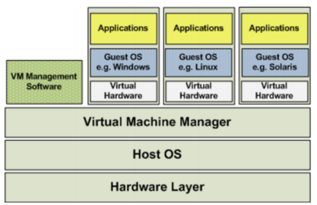
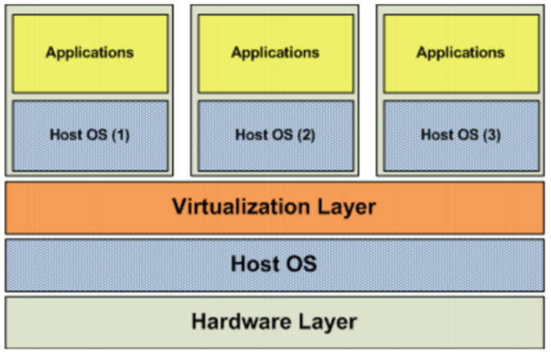
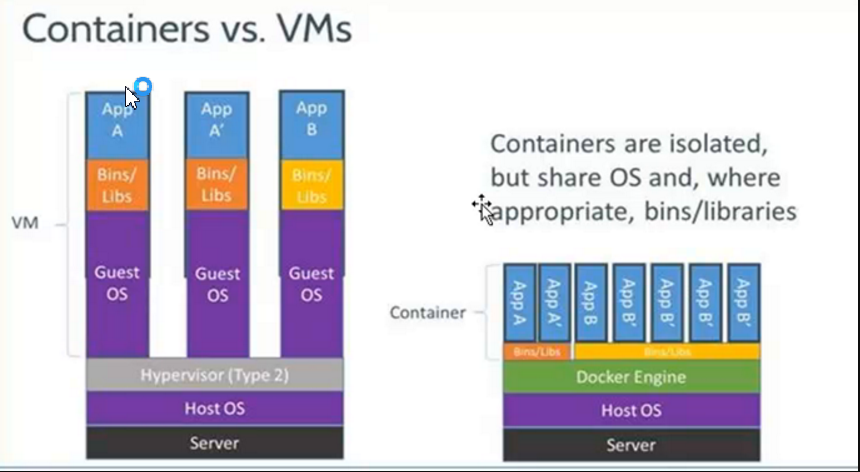
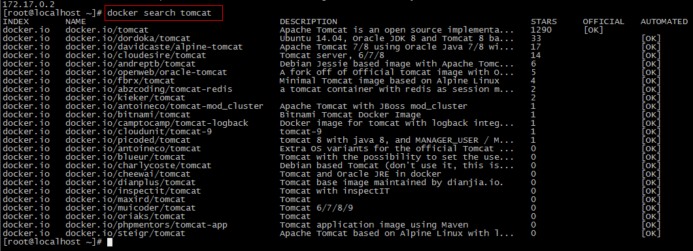

# 品优$_3 容器部署解决方案Docker

## 一、Docker简介

### 1.1 虚拟化

#### 1.1.1 什么是虚拟化

​	在计算机中，虚拟化（英语：Virtualization）是一种资源管理技术，是将计算机的各种实体资源，如服务器、网络、内存及存储等，予以抽象、转换后呈现出来，打破实体结构间的不可切割的障碍，使用户可以比原本的组态更好的方式来应用这些资源。这些资源的新虚拟部份是不受现有资源的架设方式，地域或物理组态所限制。一般所指的虚拟化资源包括计算能力和资料存储。

​	在实际的生产环境中，虚拟化技术主要用来解决高性能的物理硬件产能过剩和老的旧的硬件产能过低的重组重用，透明化底层物理硬件，从而最大化的利用物理硬件   对资源充分利用

​	虚拟化技术种类很多，例如：软件虚拟化、硬件虚拟化、内存虚拟化、网络虚拟化(vip)、桌面虚拟化、服务虚拟化、虚拟机等等。

#### 1.1.2虚拟化种类

##### （1）全虚拟化架构

虚拟机的监视器（hypervisor）是类似于用户的应用程序运行在主机的OS之上，如VMware的workstation，这种虚拟化产品提供了虚拟的硬件。 (**如： 我们开发时，使用的Vmware虚拟机**)



##### （2）OS层虚拟化架构 ： 同等内核。 若Host OS是windows, 那么虚拟只能是windows系列。



##### （3）硬件层虚拟化 ：

​	硬件层的虚拟化具有高性能和隔离性，因为hypervisor直接在硬件上运行，有利于控制VM的OS访问硬件资源，使用这种解决方案的产品有VMware ESXi 和 Xen server

​	Hypervisor是一种运行在物理服务器和操作系统之间的中间软件层,可允许多个操作系统和应用共享一套基础物理硬件，因此也可以看作是虚拟环境中的“元”操作系统，它可以协调访问服务器上的所有物理设备和虚拟机，也叫虚拟机监视器（Virtual Machine Monitor，VMM）。

​	Hypervisor是所有虚拟化技术的核心。当服务器启动并执行Hypervisor时，它会给每一台虚拟机分配适量的内存、CPU、网络和磁盘，并加载所有虚拟机的客户操作系统。  宿主机

​	Hypervisor是所有虚拟化技术的核心，软硬件架构和管理更高效、更灵活，硬件的效能能够更好地发挥出来。常见的产品有：VMware、KVM、Xen等等。Openstack。


### 1.2、什么是Docker

做产品，从开发--测试--运维。 这一系列，都存在软件搬运问题，若各自搭建一套环境，软件运行时，可能会出现各种问题。那么谁来解决此麻烦的问题呢? Docker就是今天主角！

##### Docker （集装箱，容器）： 开发直接将软件+配置环境整体打包。后续步骤，只需要开箱即可用！

#### 1.2.1 容器技术

​	由于“客居”于操作系统，容器只能运行与底层宿主机相同或者相似的操作系统，这看起来并不是非常灵活。例如：可以在Ubuntu服务中运行Redhat Enterprise Linux，但无法再Ubuntu服务器上运行Microsoft Windows。

​	docker 虚拟的操作系统是需要依赖底层操作系统，所以容器系统要与底层系统内核一致； 

#### 1.2.2 容器与虚拟机比较



##### *虚拟机已死，容器才是未来 * 

1.  size :  docker 小很多；
2. Startup：docker 运行速度快；直接一开就启动了。
3. Integration：docker 集成方便，简单。而VMare则很麻烦，步骤繁琐；

#### 1.2.3 Docker特点

**（1）上手快** 

**（2）职责的逻辑分类** 

**（3）快速高效的开发生命周期** 

**（4）鼓励使用面向服务的架构**


### 1.3 Docker组件

#### 1.3.1 Docker客户端和服务器

​	Docker是一个客户端-服务器（C/S）架构程序。Docker客户端只需要向Docker服务器或者守护进程发出请求，服务器或者守护进程将完成所有工作并返回结果。Docker提供了一个命令行工具Docker以及一整套RESTful API。你可以在同一台宿主机上运行Docker守护进程和客户端，也可以从本地的Docker客户端连接到运行在另一台宿主机上的远程Docker守护进程。 

#### 1.3.2 Docker镜像：

镜像是构建Docker的基石。用户基于镜像来运行自己的容器。镜像也是Docker生命周期中的“构建”部分。

镜像是基于联合文件系统的一种层式结构，由一系列指令一步一步构建出来。 "

也可以将镜像当作容器的“源代码”。镜像体积很小，非常“便携”，易于分享、存储和更新。 

#### 1.3.3 Registry（注册中心）： 相当于一个中央仓库，里面有很多容器的镜像；

#### 1.3.4 Docker容器

​	Docker可以帮助你构建和部署容器，你只需要把自己的应用程序或者服务打包放进容器即可。容器是基于镜像启动起来的，容器中可以运行一个或多个进程。我们可以认为，镜像是Docker生命周期中的构建或者打包阶段，而容器则是启动或者执行阶段。  容器基于镜像启动，一旦容器启动完成后，我们就可以登录到容器中安装自己需要的软件或者服务。 

##### 	---- 容器是一个运行的系统，而镜像是个静态模板。


## 二、Docker安装与启动

### 2.1安装环境说明

​	Docker官方建议在Ubuntu中安装，因为Docker是基于Ubuntu发布的，而且一般Docker出现的问题Ubuntu是最先更新或者打补丁的。在很多版本的CentOS中是不支持更新最新的一些补丁包的。

​         由于我们学习的环境都使用的是CentOS，因此这里我们将Docker安装到CentOS上。注意：这里建议安装在**CentOS7.x以上的版本**，在CentOS6.x的版本中，安装前需要安装其他很多的环境而且Docker很多补丁不支持更新。


### 2.2、安装Docker 

```shell
$ yum install docker

$ docker -v  # 查看安装后的版本信息
```


### 2.3、启动与停止Docker 

由于docker是C/S模式，我们必须启动docker service. 

由系统服务管理指令 systemctl , 即是CentOS 7之前版本service + chkconfig 两个命令组合 ;

```shell
	启动docker：
$ systemctl start docker

	停止docker：
$ systemctl stop docker

	重启docker：
$ systemctl restart docker

	查看docker状态：
$ systemctl status docker

	开机启动：
$ systemctl enable docker

	查看docker概要信息：
$ docker info
	查看docker帮助文档：
$ docker --help

```


## 三、Docker镜像操作

### 3.1什么是Docker镜像

​	Docker镜像是由文件系统叠加而成（是一种文件的存储形式）。最底端是一个文件引导系统，即bootfs，这很像典型的Linux/Unix的引导文件系统。Docker用户几乎永远不会和引导系统有什么交互。实际上，当一个容器启动后，它将会被移动到内存中，而引导文件系统则会被卸载，以留出更多的内存供磁盘镜像使用。Docker容器启动是需要的一些文件，而这些文件就可以称为Docker镜像。


### 3.2列出镜像

列出docker下的所有镜像：docker images

```shell
[root@pinyoyougou-docker ~]# docker images
REPOSITORY          TAG                 IMAGE ID            CREATED             SIZE
docker.io/mysql     latest              5fac85ee2c68        18 months ago       408.2 MB
docker.io/tomcat    7-jre7              e1ac7618b15d        18 months ago       454.3 MB
docker.io/redis     latest              1fb7b6c8c0d0        18 months ago       106.6 MB
docker.io/nginx     latest              1e5ab59102ce        18 months ago       108.3 MB
docker.io/centos    7                   196e0ce0c9fb        19 months ago       196.6 M
```

### 3.3搜索镜像

如果你需要从网络中查找需要的镜像，可以通过以下命令搜索:

```
[root@pinyoyougou-docker ~]# docker search mysql
```



- NAME：仓库名称
- DESCRIPTION：镜像描述
- STARS：用户评价，反应一个镜像的受欢迎程度
- OFFICIAL：是否官方
- AUTOMATED：自动构建，表示该镜像由Docker Hub自动构建流程创建的


### 3.4、拉取镜像

#### 3.4.1从Docker Hub拉取

​	Docker镜像首页，包括官方镜像和其它公开镜像。Docker Hub上最受欢迎的10大镜像（通过Docker registry API获取不了镜像被pull的个数，只能通过镜像的stars数量，来衡量镜像的流行度。毫无疑问，拥有最高stars数量的库都是官方库）。 

​	目前国内访问docker hub速度上有点尴尬，使用docker Mirror势在必行。现有国内提供docker镜像加速服务的商家有不少，下面重点ustc镜像。 

#### 3.4.2 ustc的镜像

ustc是老牌的linux镜像服务提供者了，还在遥远的ubuntu 5.04版本的时候就在用。ustc的docker镜像加速器速度很快。ustc docker mirror的优势之一就是不需要注册，是真正的公共服务。

<https://lug.ustc.edu.cn/wiki/mirrors/help/docker>

**步骤：**

（1）编辑该文件：vi /etc/docker/daemon.json  // 如果该文件不存在就手动创建；说明：在centos7.x下，通过vi。

```javascript
{
"registry-mirrors": ["https://docker.mirrors.ustc.edu.cn"]
}
```


### 3.5删除镜像

1、  docker rmi $IMAGE_ID：删除指定镜像

2、  docker rmi \`docker images -q`：删除所有镜像


## 四、Docker容器操作

> ```shell
> Cannot connect to the Docker daemon. Is the docker daemon running on this host?
> # 要事先开启docker,才能执行docker 命令
> ```

### 4.1 查看容器

```shell
# 	查看正在运行容器：
$ docker ps
# 	查看所有的容器（启动过的历史容器）
$ docker ps -a
# 	查看最后一次运行的容器：
$ docker ps -l
# 	查看停止的容器
$ docker ps -f status=exited
```

### 4.2 创建与启动容器

```shell
# 	创建容器命令：
$ docker run [option]
# option 说明
	-i：表示运行容器
	-t：表示容器启动后会进入其命令行。加入这两个参数后，容器创建就能登录进去。即分配一个伪终端。
	--name :为创建的容器命名。
	-v：表示目录映射关系（前者是宿主机目录，后者是映射到宿主机上的目录），可以使用多个－v做多个目录或文件映射。注意：最好做目录映射，在宿主机上做修改，然后共享到容器上。
	-d：在run后面加上-d参数,则会创建一个守护式容器在后台运行（这样创建容器后不会自动登录容器，如果只加-i -t两个参数，创建后就会自动进去容器）。
	-p：表示端口映射，前者是宿主机端口，后者是容器内的映射端口。可以使用多个－p做多个端口映射
```

#### 4.2.1 交互式容器

创建一个交互式容器并取名为mycentos 。 容器名称不能重复！

```shell
$ docker run -it --name=mycentos centos:7 /bin/bash
$ exit # 退出 会让容器也直接关机 

# 关机后，再启动 
$ docker start mycentos  # 此时已成为守护式容器
$ docker exec -it mycentos /bin/bash  # 再次进入容器的交互界面
$ exit # 此时，容器并不会关机

# 若要强行关机
$ docker stop mycentos 
```

#### 4.2.2 守护式容器

```shell
$ docker run -di --name=mycentos2 centos:7
```


### 4.3停止与启动容器

```shell
$ docker start mycentos 
$ docker stop mycentos 
```


### 4.4 文件拷贝

如果我们需要将文件拷贝到容器内可以使用cp命令 !

```shell
            # 需要拷贝的文件或目录    容器名称:容器目录
$ docker  cp   /root/testfile      mycentos:/usr/local 

$ docker  cp   /root/testfile      mycentos:/usr/local 
```

> ##### 容器之间是无法直接cp的。若实在需要，必须用宿主机当中介传递！


### 4.5 目录挂载

我们可以在创建容器的时候，将宿主机的目录与容器内的目录进行映射，这样我们就可以通过修改宿主机某个目录的文件从而去影响容器。

创建容器 添加-v参数 后边为   宿主机目录:容器目录

```shell
$ docker run -di -v /usr/local/myhtml:/usr/local/mh --name=mycentos2 centos:7
```

如果你共享的是多级的目录，可能会出现权限不足的提示 

```shell
# Permission denied 权限不足
# 如何解决，创建容器  --privileged=true 
$ docker run -di -v /usr/local/myhtml:/usr/local/mh --name=mycentos2 centos:7 --privileged=true 
```


### 4.6 查看容器IP地址

我们可以通过以下命令查看容器运行的各种数据 :

```shell
$ docker inspect mycentos2

$ docker inspect --format='{{.NetworkSettings.IPAddress}}' mycentos2
172.17.0.2
```


### 4.7 删除容器

- 删除指定的容器：docker rm \$CONTAINER_ID/NAME iD
- 删除所有容器：docker rm \`docker ps -a -q` 


## 五、部署应用 

### 5.1 MySQL部署

#### 5.1.1 拉取MySQL镜像

```
$ docker pull mysql 
```

### 5.1.2 创建MySQL容器

```shell
$ docker run -di --name pinyougou_mysql -p 33306:3306 -e MYSQL_ROOT_PASSWORD=123456 mysql

$ docker exec -it pinyougou_mysql /bin/bash

$ mysql -u root -p 123456 # 进入容器的mysql
```

#### 5.1.3 其他操作

- 远程连接MySQL;
- 查看ip : 为了给其他docker容器使用； 172.17.0.3

> ```shell
> # CentOS7 开启端口， 没有之间的iptables service了， 由firewalld代替
> $ firewall-cmd --zone=public --add-port=3306/tcp --permanent
> 
> # 查询端口号80 是否开启：
> $ firewall-cmd --query-port=80/tcp
> 
> # 查询有哪些端口是开启的:
> $ firewall-cmd --list-port
> ```


### 5.2 tomcat部署

- ##### 在宿主机，放置一个tomcat/webapps映射目录

```shell
$ mkdir /usr/local/myhtml

$ put -r d:/cas  # 将cas上传到宿主机
$ mv cas /usr/local/myhtml 移动到映射目录
```

- ##### 创建启动 pinyougou-tomcat:  并用9000映射docker的8080端口

```shell
$ docker run -di --name=pinyougou_tomcat -v /usr/local/myhtml:/usr/local/tomcat/webapps --privileged=true -p 9000:8080 tomcat:7-jre7
```

- ##### 修改cas系统的配置文件，修改数据库连接的url 

```xml
<bean id="dataSource" class="com.mchange.v2.c3p0.ComboPooledDataSource"                   p:driverClass="com.mysql.jdbc.Driver"                   p:jdbcUrl="jdbc:mysql://172.17.0.2:3306/pinyougoudb?characterEncoding=utf8"                   p:user="root"                   p:password="123456" />
```

> ##### 若容器tomcat的配置文件有修改，必须重启docker容器才能生效！


### 5.3 Nginx部署

参考讲义！

### 5.4 Redis部署

参考讲义！


## 六、备份与迁移 

### 6.1 容器保存为镜像

我们可以通过以下命令将容器保存为镜像：

```shell
$ docker commit pinyougou_nginx mynginx
```

### 6.2 镜像备份

```shell
$ docker save -o mynginx.tar mynginx
```

-o 输出到的文件

执行后，运行ls命令即可看到打成的tar包;

### 6.3 镜像恢复与迁移

```shell
$ docker load -i mynginx.tar
```

