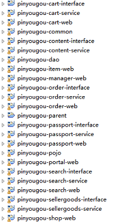

# 品优01_dubbox

## 一、电商行业技术特点

技术新，

技术范围广，

分布式，

高并发、集群、负载均衡、高可用，

海量数据，

业务复杂，

系统安全


## 二、品优购－需求分析与系统设计

### 2.1、品优购简介

​	品优购网上商城是一个综合性的 B2B2C 平台，类似京东商城、天猫商城。网站采用商家入驻的模式，商家入驻平台提交申请，有平台进行资质审核，审核通过后，商家拥有独立的管理后台录入商品信息。商品经过平台审核后即可发布。

​	品优购网上商城主要分为网站前台、运营商后台、商家管理后台三个子系统。

- #### 网站前台

- #### 运营商后台

- #### 商家管理后台


### 2.2、系统架构

#### 2.2.1、什么是SOA架构？

SOA是Service-Oriented Architecture的首字母简称，它是一种支持面向服务的架构样式。从服务、基于服务开发和服务的结果来看，面向服务是一种思考方式。其实SOA架构更多应用于互联网项目开发。

为什么互联网项目会采用SOA架构呢？随着互联网的发展，网站应用的规模不断扩大，常规的垂直应用架构已无法应对，分布式服务架构以及流动计算架构势在必行，迫切需一个治理系统确保架构有条不紊的演进。

#### 2.2.2、 品优购架构分析


### 2.3、数据库表结构

| **表名称**              | **含义**                     |
| ----------------------- | ---------------------------- |
| tb_brand                | 品牌                         |
| tb_specification        | 规格                         |
| tb_specification_option | 规格选项                     |
| tb_type_template        | 类型模板：用于关联品牌和规格 |
| tb_item_cat             | 商品分类                     |
| tb_seller               | 商家                         |
| tb_goods                | 商品                         |
| tb_goods_desc           | 商品详情                     |
| tb_item                 | 商品明细                     |
| tb_content              | 内容（广告）                 |
| tb_content_category     | 内容（广告）类型             |
| tb_user                 | 用户                         |
| tb_order                | 订单                         |
| tb_order_item           | 订单明细                     |
| tb_pay_log              | 支付日志                     |

### 2.4、框架组合

品优购采用当前流行的前后端编程架构。

后端框架采用Spring +SpringMVC+mybatis +Dubbox 。前端采用angularJS + Bootstrap。


## 三、Dubbox框架（重点）

### 3.1、Dubbox简介

​	Dubbox 是一个分布式服务框架，其前身是阿里巴巴开源项目Dubbo ，被国内电商及互联网项目中使用，后期阿里巴巴停止了该项目的维护，当当网便在Dubbo基础上进行优化，并继续维护，为了与原有的Dubbo区分，故将其命名为**Dubbox**。

​	Dubbox 致力于提供高性能和透明化的RPC远程服务调用方案，以及SOA服务治理方案。简单的说，dubbox就是个服务框架，如果没有分布式的需求，其实是不需要用的，只有在分布式的时候，才有dubbox这样的分布式服务框架的需求，并且本质上是个服务调用的东东，说白了就是个远程服务调用的分布式框架。


**节点角色说明：**

 Provider: 暴露服务的服务提供方。

 Consumer: 调用远程服务的服务消费方。

 Registry: 服务注册与发现的注册中心。

 Monitor: 统计服务的调用次调和调用时间的监控中心。

 Container: 服务运行容器。

**调用关系说明：**

 0. 服务容器负责启动，加载，运行服务提供者。

 1. 服务提供者在启动时，向注册中心注册自己提供的服务。

 2. 服务消费者在启动时，向注册中心订阅自己所需的服务。

 3. 注册中心返回服务提供者地址列表给消费者，如果有变更，注册中心将基于长连接推

送变更数据给消费者。

 4. 服务消费者，从提供者地址列表中，基于软负载均衡算法，选一台提供者进行调用，

如果调用失败，再选另一台调用。

 5. 服务消费者和提供者，在内存中累计调用次数和调用时间，定时每分钟发送一次统计

数据到监控中心。


### 3.2、注册中心Zookeeper

#### 3.2.1、Zookeeper介绍

​	官方推荐使用 zookeeper 注册中心。注册中心负责服务地址的注册与查找，相当于目录服务，服务提供者和消费者只在启动时与注册中心交互，注册中心不转发请求，压力较小。

​	Zookeeper 是 Apacahe Hadoop 的子项目，是一个树型的目录服务，支持变更推送，适合作为Dubbox 服务的注册中心，工业强度较高，可用于生产环境。


#### 3.2.2、 Zookeeper 在Linux系统的安装

- ##### 安装步骤：

  - 第一步：安装 jdk（此步省略，我给大家提供的镜像已经安装好JDK）;

  - 第二步：把 zookeeper 的压缩包（资源\配套软件\dubbox\zookeeper-3.4.6.tar.gz）上传到 linux 系统，并解压。

    ```shell
    # windows 直接可以使用SecureCRT工具连接Linux。然后alt＋p，使用SFTP界面，put d:\zookeeper-3.4.6.tar.gz上传即可
    
    # Linux 端口22 
    
    win10 系统安装vmware 启动Linux： 
    1. 二进制转换与此平台上的长模式不兼容，此虚拟环境中的长模式将被禁用”问题；
    	原因：在使用Windows7 64位操作系统时，无法运行VMWare或MS Virtual server等软件虚拟操作系统。提示为“提示：软件虚拟化与此平台上的长模式不兼容. 禁用长模式. 没有长模式支持, 虚拟机将不能运行 64 位程序. ”产生这个错误的主要原因是现在平常用的VMWare等软件本身都是基于32位的，如果要在其上运行64位虚拟机，需要把虚拟化打开！而Windows7 64位操作系统在默认情况下是关闭的！
    	解决方法：
    	方案一：（是终极方案，但是复杂，不推荐）
    	1） 首现我们需要下载一个绿色的小巧软件（114K），来检测VT虚拟化技术是否开启；【CPU-Z】
    	2） 如果显示为“NO”，则说明VT虚拟化技术未能成功开启。需要重启笔记本后登录BIOS设置界面，进入“Configuration”菜单，找到 “Intel(R) Virtual Technology”选项，将其值改为“Enabled”，保存退出后登录系统。
    	
    	方案二：通过修改VMWare软件设定，临时性解决不兼容问题。但新建虚拟机后，需要再次进行以下设置；（推荐）
    	1）对虚拟机相对应的.vmx文件进行编辑修改。用记事本打开.vmx文件，找到：vmci0.present=“TRUE”将TRUE改为FALSE或者直接将这行删掉。保存此虚拟机的.vmx文件（可能先要关闭Vm，然后才能保存，再打开VM）。重新运行虚拟机。OK。（注意：刚刚安装好VMware Workstation以后是找不到这个文件的，当你在VMware Workstation中建立了一个虚拟机以后，这个文件才会出现。）
    	2）[这一步非必要操作]在vm软件界面上，编辑虚拟机设置。在虚拟机设置->选项->客户机隔离->VM通信接口(VMCI)把启用VMCI的钩去掉。点击确定保存。重新运行虚拟机。OK。
    	
    
    
    # unix mac os 
    # 1. 上传：
    $ scp /Volumes/C/Study/Dubbox/zookeeper-3.4.6.tar.gz root@192.168.25.128:/root
    # 2. 解压
    $ tar -zxvf zookeeper-3.4.6.tar.gz
    ```

  - 第三步：进入 zookeeper-3.4.6 目录，创建 data 文件夹。

    ```shell
    $ mkdir data
    ```

  - 第四步：进入conf目录，把 zoo_sample.cfg 改名为 zoo.cfg，并修改dataDir＝/root/zookeeper-3.4.6/data；

    ```shell
    $ mv zoo_sample.cfg zoo.cfg
    $ vim zoo.cfg
    ```

- ##### Zookeeper 服务启动

  ```shell
  $ cd /zookeeper-3.4.6/bin
  $ ./zkServer.sh -start #启动zookeeper
  $ ./zkServer.sh -stop #停止zookeeper
  $ ./zkServer.sh -status #查看zookeeper运行状态
  ```

> 网络适配器：默认（NAT、桥接、仅主机），自定义。
>
> 选择仅主机，子网IP：192.168.25.0 （以25结束，方便后续图片上传服务器对接！）
>
> Mac 系统下vmware修改虚拟机ip：
>
> ```shell
> # 1. 系统管理员身份操作
> $ sudo -i;
> 
> # 2. 修改/Library/Preferences/VMware Fusion/networking配置
> $ vim /Library/Preferences/VMware Fusion/networking
> 
> # 3. 在mac下安装vmware fusion会自动创建三个网卡,分别是VMnet1,VMnet8,VMnet0
> # VMnet1: 对应Host-only模式,也就是自定下的“仅供我的Mac专用”
> # VMnet8:对应NAT模式,也就是网络配置中的Internet共享下的“与我的Mac共享”
> # VMnet0:对应桥接模式,也就是桥接模式网络链接下的“自动检测”
> # 每次安装vmware fusion,vmware fusion自动生成的ip段都不一样.为了保持一致,可以修改vmware fusion的配置文件.配置文件的路径在/Library/Preferences/VMware Fusion/networking
> 
> VERSION=1,0
> answer VNET_1_DHCP yes
> answer VNET_1_DHCP_CFG_HASH F61C153C4334B686D141FE7F62DD8A79202454FA
> answer VNET_1_HOSTONLY_NETMASK 255.255.255.0
> answer VNET_1_HOSTONLY_SUBNET 192.168.10.0 # 将此此处改为192.168.25.0
> answer VNET_1_VIRTUAL_ADAPTER yes
> answer VNET_8_DHCP yes
> answer VNET_8_DHCP_CFG_HASH 2D5217E4A3D7ED4DB6DE69E9F92B0E485E346C2A
> answer VNET_8_HOSTONLY_NETMASK 255.255.255.0
> answer VNET_8_HOSTONLY_SUBNET 10.10.10.0
> answer VNET_8_NAT yes
> answer VNET_8_VIRTUAL_ADAPTER yes
> 
> # 4. 刷新配置，一般重启vmware即可。
> # 5. 附带两个命令:
> /Applications/VMware\ Fusion.app/Contents/Library/vmnet-cli --status
> /Applications/VMware\ Fusion.app/Contents/Library/vmnet-cli --start
> ```


### 3.3 Dubbox本地 JAR包部署与安装（了解）

Dubbox的jar包并没有部署到Maven的中央仓库中，大家在Maven的中央仓库中可以查找到Dubbo的最终版本是2.5.3 , 阿里巴巴解散了Dubbo团队后由当当网继续维护此项目，并改名为 Dubbox ,坐标不变，版本变更了，但是并没有提交到中央仓库。

我们现在需要手动将Dubbox的jar包安装到我的本地仓库中。

先将dubbo-2.8.4.jar包放到d:\setup, 然后输入命令：

```shell
$ mvn install:install-file -Dfile=d:\setup\dubbo-2.8.4.jar -DgroupId=com.alibaba -DartifactId=dubbo -Dversion=2.8.4 -Dpackaging=jar

HawiniMac:~ root# mvn install:install-file -Dfile=/Volumes/C/Soft/dubbo-2.8.4.jar -DgroupId=com.alibaba -DartifactId=dubbo -Dversion=2.8.4 -Dpackaging=jar
[INFO] Scanning for projects...
[INFO] 
[INFO] ------------------------------------------------------------------------
[INFO] Building Maven Stub Project (No POM) 1
[INFO] ------------------------------------------------------------------------
[INFO] 
[INFO] --- maven-install-plugin:2.4:install-file (default-cli) @ standalone-pom ---
[INFO] Installing /Volumes/C/Soft/dubbo-2.8.4.jar to /Volumes/C/maven_repository/com/alibaba/dubbo/2.8.4/dubbo-2.8.4.jar
[INFO] Installing /var/folders/zz/zyxvpxvq6csfxvn_n0000000000000/T/mvninstall4507458035787951366.pom to /Volumes/C/maven_repository/com/alibaba/dubbo/2.8.4/dubbo-2.8.4.pom
[INFO] ------------------------------------------------------------------------
[INFO] BUILD SUCCESS
[INFO] ------------------------------------------------------------------------
[INFO] Total time: 1.416 s
[INFO] Finished at: 2019-03-04T11:52:14+08:00
[INFO] Final Memory: 5M/123M
[INFO] ------------------------------------------------------------------------
```


#### 3.4、配置离线约束


eclipse：preferences －> xml catalog －> add : 

location: 直接FileSystem，选择dubbo.xsd路径

keytype：schema location

key: `http://code.alibabatech.com/schema/dubbo/dubbo.xsd`


### 3.5、Dubbo入门Demo

- 服务提供者 dubbodemo-service： 是一个war工程。

```xml
<?xml version="1.0" encoding="UTF-8"?>
<beans xmlns="http://www.springframework.org/schema/beans"
	xmlns:xsi="http://www.w3.org/2001/XMLSchema-instance" xmlns:p="http://www.springframework.org/schema/p"
	xmlns:context="http://www.springframework.org/schema/context"
	xmlns:dubbo="http://code.alibabatech.com/schema/dubbo" xmlns:mvc="http://www.springframework.org/schema/mvc"
	xsi:schemaLocation="http://www.springframework.org/schema/beans http://www.springframework.org/schema/beans/spring-beans.xsd
        http://www.springframework.org/schema/mvc http://www.springframework.org/schema/mvc/spring-mvc.xsd
        http://code.alibabatech.com/schema/dubbo http://code.alibabatech.com/schema/dubbo/dubbo.xsd
        http://www.springframework.org/schema/context http://www.springframework.org/schema/context/spring-context.xsd">

   	<dubbo:application name="dubbodemo-service"/>  
	<dubbo:registry address="zookeeper://192.168.25.128:2181"/> 
	<dubbo:annotation package="com.itcast.service.impl" /> <!--扫描实现类，注解在此-->
</beans>
```

```java
import com.alibaba.dubbo.config.annotation.Service;
import com.itcast.service.UserService;

@Service // 此时的service是dubbo的Service，不是spring的service
public class UserServiceImpl implements UserService{
	public String showContent() {
		return "dubbox demo 服务提供方！！！！！";
	}
}
```

- 服务消费者

```java
@Controller
@RequestMapping("/user")
public class UserController {
	@Reference // 不能是autowired，因项目没有实现类了，实现类在服务提供者那里
	private UserService userService; // 此类必须与服务提供者的接口名称，包名一致。即copy过来
	
	@RequestMapping("/showContent")
	@ResponseBody // 直接将字段供页面显示
	public String showContent() {
		System.out.println("11111111");
		return userService.showContent();
	}
}
```

```xml
<?xml version="1.0" encoding="UTF-8"?>
<beans xmlns="http://www.springframework.org/schema/beans"
	xmlns:xsi="http://www.w3.org/2001/XMLSchema-instance" xmlns:p="http://www.springframework.org/schema/p"
	xmlns:context="http://www.springframework.org/schema/context"
	xmlns:dubbo="http://code.alibabatech.com/schema/dubbo" xmlns:mvc="http://www.springframework.org/schema/mvc"
	xsi:schemaLocation="http://www.springframework.org/schema/beans http://www.springframework.org/schema/beans/spring-beans.xsd
        http://www.springframework.org/schema/mvc http://www.springframework.org/schema/mvc/spring-mvc.xsd
        http://code.alibabatech.com/schema/dubbo http://code.alibabatech.com/schema/dubbo/dubbo.xsd
        http://www.springframework.org/schema/context http://www.springframework.org/schema/context/spring-context.xsd">
	<!--转换器：将字符串自动转换为json，供页面解析？？-->
	<mvc:annotation-driven >
		<mvc:message-converters register-defaults="false">
			<bean class="org.springframework.http.converter.StringHttpMessageConverter">  
				<constructor-arg value="UTF-8" />
			</bean>  
		</mvc:message-converters>	
	</mvc:annotation-driven>
	
	<dubbo:application name="dubbodemo-web"/>  
	<dubbo:registry address="zookeeper://192.168.25.128:2181"/> 
	<dubbo:annotation package="com.itcast.controller" /> 
</beans>
```

```xml
<?xml version="1.0" encoding="UTF-8"?>
<web-app xmlns:xsi="http://www.w3.org/2001/XMLSchema-instance"
	xmlns="http://java.sun.com/xml/ns/javaee"
	xsi:schemaLocation="http://java.sun.com/xml/ns/javaee http://java.sun.com/xml/ns/javaee/web-app_2_5.xsd"
	version="2.5">	
   <!-- 解决post乱码 -->
	<filter>
		<filter-name>CharacterEncodingFilter</filter-name>
		<filter-class>org.springframework.web.filter.CharacterEncodingFilter</filter-class>
		<init-param>
			<param-name>encoding</param-name>
			<param-value>utf-8</param-value>
		</init-param>
		<init-param>  
            <param-name>forceEncoding</param-name>  
            <param-value>true</param-value>  
        </init-param>  
	</filter>
	<filter-mapping>
		<filter-name>CharacterEncodingFilter</filter-name>
		<url-pattern>/*</url-pattern>
	</filter-mapping>	
	
  <servlet>
  	<servlet-name>springmvc</servlet-name>
  	<servlet-class>org.springframework.web.servlet.DispatcherServlet</servlet-class>
  	<!-- 指定加载的配置文件 ，通过参数contextConfigLocation加载-->
  	<init-param>
  		<param-name>contextConfigLocation</param-name>
  		<param-value>classpath:springmvc.xml</param-value>
  	</init-param>
  </servlet>
  
  <servlet-mapping>
  	<servlet-name>springmvc</servlet-name>
  	<url-pattern>*.do</url-pattern> <!--过滤路径带.do的访问： 本测试url： localhost:8082/user/showContent.do 即可跳转到对应的UserController-->
  </servlet-mapping>
</web-app>
```

```xml
<project xmlns="http://maven.apache.org/POM/4.0.0"
	xmlns:xsi="http://www.w3.org/2001/XMLSchema-instance"
	xsi:schemaLocation="http://maven.apache.org/POM/4.0.0 http://maven.apache.org/xsd/maven-4.0.0.xsd">
	<modelVersion>4.0.0</modelVersion>
	<groupId>com.itcast.dubbo</groupId>
	<artifactId>dubbodemo-web</artifactId>
	<version>0.0.1-SNAPSHOT</version>
	<packaging>war</packaging>

	<properties>
		<spring.version>4.2.4.RELEASE</spring.version>
	</properties>

	<dependencies>
		<!-- Spring -->
		<dependency>
			<groupId>org.springframework</groupId>
			<artifactId>spring-context</artifactId>
			<version>${spring.version}</version>
		</dependency>
		<dependency>
			<groupId>org.springframework</groupId>
			<artifactId>spring-beans</artifactId>
			<version>${spring.version}</version>
		</dependency>
		<dependency>
			<groupId>org.springframework</groupId>
			<artifactId>spring-webmvc</artifactId>
			<version>${spring.version}</version>
		</dependency>
		<dependency>
			<groupId>org.springframework</groupId>
			<artifactId>spring-jdbc</artifactId>
			<version>${spring.version}</version>
		</dependency>
		<dependency>
			<groupId>org.springframework</groupId>
			<artifactId>spring-aspects</artifactId>
			<version>${spring.version}</version>
		</dependency>
		<dependency>
			<groupId>org.springframework</groupId>
			<artifactId>spring-jms</artifactId>
			<version>${spring.version}</version>
		</dependency>
		<dependency>
			<groupId>org.springframework</groupId>
			<artifactId>spring-context-support</artifactId>
			<version>${spring.version}</version>
		</dependency>

		<!-- dubbo相关 -->
		<dependency>
			<groupId>com.alibaba</groupId>
			<artifactId>dubbo</artifactId>
			<version>2.8.4</version>
		</dependency>
		<dependency>
			<groupId>org.apache.zookeeper</groupId>
			<artifactId>zookeeper</artifactId>
			<version>3.4.6</version>
		</dependency>
		<dependency>
			<groupId>com.github.sgroschupf</groupId>
			<artifactId>zkclient</artifactId>
			<version>0.1</version>
		</dependency>

		<dependency>
			<groupId>javassist</groupId>
			<artifactId>javassist</artifactId>
			<version>3.11.0.GA</version>
		</dependency>

	</dependencies>
	<build>
		<plugins>
			<plugin>
				<groupId>org.apache.maven.plugins</groupId>
				<artifactId>maven-compiler-plugin</artifactId>
				<version>2.3.2</version>
				<configuration>
					<source>1.7</source>
					<target>1.7</target>
				</configuration>
			</plugin>
			<plugin>
				<groupId>org.apache.tomcat.maven</groupId>
				<artifactId>tomcat7-maven-plugin</artifactId>
				<configuration>
					<!-- 指定端口 -->
					<port>8082</port>
					<!-- 请求路径 -->
					<path>/</path>
				</configuration>
			</plugin>
		</plugins>
	</build>
</project>
```


### 3.6、Dubbox管理中心的部署

我们在开发时，需要知道注册中心都注册了哪些服务，以便我们开发和测试。我们可以通过部署一个管理中心来实现。其实管理中心就是一个web应用，部署到tomcat即可。

#### 管理端安装

（1）编译源码，得到war包

给大家下发的资源中有个dubbox-master.zip  ，这个是dubbox的源码，我们可以使用maven命令编译源码得到“管理端”的war包

将此压缩包解压，在命令符下进入dubbo-admin目录 ，输入maven命令:

```shell
$ mvn package -Dmaven.skip.test=true
```

> 注意：打包pom.xml依赖很多jar可能本地仓库没有，需要联网加载！

(2) 将tomcat ／ dubbo-admin.war上传到Linux。解压到webapps目录即可。

```shell
192.168.25.128:8080/dubbo-admin  即可以到dubbo的管理界面
```


## 四、品优架构搭建

### 4.1、工程结构分析与设计

最终完整的工程结构如下：




工程说明：

pinyougou-parent 聚合工程

pinyougou-pojo 通用实体类层

pinyougou-dao 通用数据访问层

pinyougou-xxxxx-interface  某服务层接口

pinyougou-xxxxx-service   某服务层实现

pinyougou-xxxxx-web     某web工程  


### 4.2、搭建框架

#### 4.2.1、父工程

​	创建Maven工程pinyougou-parent （POM） ，groupId 为com.pinyougou ,artifactId 为pinyougou-parent ,  在pom.xml中添加锁定版本信息dependencyManagement与pluginManagement。 －－ 父工程的作用！

​	pom.xml详细参考代码！

#### 4.2.2、通用实体类模块

创建通用实体类模块-pinyougou-pojo； －－ jar包形式

#### 4.2.3、通用数据访问模块

创建通用数据访问模块pinyougou-dao，添加依赖Mybatis和pinyougou-pojo ；－－jar包形式

##### 注意：各个模块具体添加各自的依赖，若在父工程添加所有依赖，会导致模块的过度依赖。

> ##### 》pinyougou-pojo 与 pinyougou-dao 使用mybatis的逆向工程，自动完成所有代码编写！《
>
> 详细参考：[mybatis的逆向工程]()

#### 4.2.4、通用工具类模块

创建通用工具类模块pinyougou-common；－－jar包形式

#### 4.2.5、商家商品服务接口模块

创建maven（jar）模块pinyougou-sellergoods-interface  , pom.xml添加pinyougou-pojo依赖。

> ##### 单独列出来是由于dubbo的消费方需要依赖此接口，提供方也需要依赖；

#### 4.2.6、商家商品服务模块 －－war：一个dubbo的注册服务提供者

创建maven（war）模块pinyougou-sellergoods-service，pom.xml引入依赖pinyougou-sellergoods-interface，pinyougou-dao；（pojo可以传递依赖进来）

- web.xml

  ```xml
  <?xml version="1.0" encoding="UTF-8"?>
  <web-app xmlns:xsi="http://www.w3.org/2001/XMLSchema-instance"
  	xmlns="http://java.sun.com/xml/ns/javaee"
  	xsi:schemaLocation="http://java.sun.com/xml/ns/javaee http://java.sun.com/xml/ns/javaee/web-app_2_5.xsd"
  	version="2.5">	
  	<!-- 加载spring容器 -->
  	<context-param>
  		<param-name>contextConfigLocation</param-name>
  		<param-value>classpath*:spring/applicationContext*.xml</param-value>
  	</context-param>
  	<listener>
  	<listener-class>org.springframework.web.context.ContextLoaderListener</listener-class>
  	</listener>
  </web-app>
  ```

- spring/applicationContext-service.xml

  ```xml
  <?xml version="1.0" encoding="UTF-8"?>
  <beans xmlns="http://www.springframework.org/schema/beans"
  	xmlns:xsi="http://www.w3.org/2001/XMLSchema-instance" xmlns:p="http://www.springframework.org/schema/p"
  	xmlns:context="http://www.springframework.org/schema/context"
  	xmlns:dubbo="http://code.alibabatech.com/schema/dubbo" xmlns:mvc="http://www.springframework.org/schema/mvc"
  	xsi:schemaLocation="http://www.springframework.org/schema/beans http://www.springframework.org/schema/beans/spring-beans.xsd
          http://www.springframework.org/schema/mvc http://www.springframework.org/schema/mvc/spring-mvc.xsd
          http://code.alibabatech.com/schema/dubbo http://code.alibabatech.com/schema/dubbo/dubbo.xsd
          http://www.springframework.org/schema/context http://www.springframework.org/schema/context/spring-context.xsd">
      
  	<!-- 默认port：20880  因为有很多个服务，若不配置port就会混乱。 -->
       <dubbo:protocol name="dubbo" port="20881"></dubbo:protocol>
  	<dubbo:application name="pinyougou-sellergoods-service"/>  
      <dubbo:registry address="zookeeper://192.168.25.129:2181"/>
  	<dubbo:annotation package="com.pinyougou.sellergoods.service.impl" />  
  </beans>
  ```

#### 4.2.7、运营商管理后台 －－ war：dubbo的web消费者。有界面springmvc

创建maven（war）模块pinyougou-manager-web， pom.xml引入依赖 pinyougou-sellgoods-interface, 

```xml
<?xml version="1.0" encoding="UTF-8"?>
<beans xmlns="http://www.springframework.org/schema/beans"
       xmlns:xsi="http://www.w3.org/2001/XMLSchema-instance" xmlns:p="http://www.springframework.org/schema/p"
       xmlns:context="http://www.springframework.org/schema/context"
       xmlns:dubbo="http://code.alibabatech.com/schema/dubbo" xmlns:mvc="http://www.springframework.org/schema/mvc"
       xsi:schemaLocation="http://www.springframework.org/schema/beans http://www.springframework.org/schema/beans/spring-beans.xsd
                           http://www.springframework.org/schema/mvc http://www.springframework.org/schema/mvc/spring-mvc.xsd
                           http://code.alibabatech.com/schema/dubbo http://code.alibabatech.com/schema/dubbo/dubbo.xsd
                           http://www.springframework.org/schema/context http://www.springframework.org/schema/context/spring-context.xsd">
    <mvc:annotation-driven>
        <mvc:message-converters register-defaults="true">
            <bean class="com.alibaba.fastjson.support.spring.FastJsonHttpMessageConverter">  
                <property name="supportedMediaTypes" value="application/json"/>
                <property name="features">
                    <array>
                        <value>WriteMapNullValue</value>
                        <value>WriteDateUseDateFormat</value>
                    </array>
                </property>
            </bean>
        </mvc:message-converters>  
    </mvc:annotation-driven>
    <!-- 引用dubbo 服务 -->
    <dubbo:application name="pinyougou-manager-web" />
    <dubbo:registry address="zookeeper://192.168.25.132:2181"/>
    <dubbo:annotation package="com.pinyougou.manager.controller" />  	
</beans>
```


## 五、后端代码编写：参考具体代码

## 六、错误总结

6.1、mybatis逆向工程，在mac系统下无法生成对应的文件。问题所在：unix与windows的系统路径有区别。

```properties
windows: d:\src\com\mybaits
mac os: Volmuns/src/com/mybatis
```

6.2、error log-01

```properties
errorInfo: Failed to execute goal on project basic-core-data: Could not resolve dependencies for project ct com...

resolution: 先将整个项目install 一下生成父pom信息    再install  utils模块即可
```

6.3、error log-02

```properties
java.lang.IllegalStateException: Failed to check the status of the service com.pinyougou.sellergoods.service.BrandService. No provider available for the service com.pinyougou.sellergoods.service.BrandService from the url zookeeper://192.168.25.129:2181/com.alibaba.dubbo.registry.RegistryService?application=pinyougou-manager-web&dubbo=2.8.4&interface=com.pinyougou.sellergoods.service.BrandService&methods=update,get,delete,selectOptionList,add,getListByPage&pid=3980&revision=0.0.1-SNAPSHOT&side=consumer&timestamp=1501146823396 to the consumer 172.16.17.14 use dubbo version 2.8.4
```

> 这种错误是服务层代码没有成功注册到注册中心导致，请检查一下你的服务层代码是否添加了@service注解，并且该注解的包一定是com.alibaba.dubbo.config.annotation包，不是org.springframework.stereotype.Service，这个地方极容易出错。另外还有一个原因就是你的服务层工程由于某些原因没有正常启动，也无法注册到注册中心里。

6.4、error log-03

```properties
org.I0Itec.zkclient.exception.ZkTimeoutException: Unable to connect to zookeeper server within timeout: 5000	org.I0Itec.zkclient.ZkClient.connect(ZkClient.java:876)	org.I0Itec.zkclient.ZkClient.<init>(ZkClient.java:98)	org.I0Itec.zkclient.ZkClient.<init>(ZkClient.java:92)	org.I0Itec.zkclient.ZkClient.<init>(ZkClient.java:80) com.alibaba.dubbo.remoting.zookeeper.zkclient.ZkclientZookeeperClient.<init>(ZkclientZookeeperClient.java:26)
```

> 请检查IP与端口是否填写正确，检查注册中心是否正常启动

6.5、error log4

```properties
# 在mac系统下运行dubbo项目没有问题，回到家在win10 系统运行sellergood-service服务就有如下错误：
Caused by: java.lang.RuntimeException: java.io.IOException: invalid constant type: 18
    at javassist.CtClassType.getClassFile2(CtClassType.java:203)
    at javassist.compiler.MemberResolver.lookupMethod(MemberResolver.java:110)
    at javassist.compiler.MemberResolver.lookupMethod(MemberResolver.java:96)
    at javassist.compiler.TypeChecker.atMethodCallCore(TypeChecker.java:704)
    at javassist.compiler.TypeChecker.atCallExpr(TypeChecker.java:681)
...
    at javassist.compiler.Javac.compileMethod(Javac.java:168)
    at javassist.compiler.Javac.compile(Javac.java:94)
    at javassist.CtNewMethod.make(CtNewMethod.java:73)
    at javassist.CtNewMethod.make(CtNewMethod.java:44)
    at com.alibaba.dubbo.common.bytecode.ClassGenerator.toClass(ClassGenerator.java:322)
    at com.alibaba.dubbo.common.bytecode.ClassGenerator.toClass(ClassGenerator.java:293)
    at com.alibaba.dubbo.common.bytecode.Wrapper.makeWrapper(Wrapper.java:346)
    at com.alibaba.dubbo.common.bytecode.Wrapper.getWrapper(Wrapper.java:89)
    at com.alibaba.dubbo.config.ServiceConfig.doExportUrlsFor1Protocol(ServiceConfig.java:430)
    at com.alibaba.dubbo.config.ServiceConfig.doExportUrls(ServiceConfig.java:285)
    at com.alibaba.dubbo.config.ServiceConfig.doExport(ServiceConfig.java:246)
    at com.alibaba.dubbo.config.ServiceConfig.export(ServiceConfig.java:145)
...

# 由于在公司的jdk版本是1.8，而自己的电脑jdk是9.0。当dubbo调用javassist编译字节码与当前jdk9.0不兼容而出错。 jdk9.0需要将javassist版本升级到3.18.0以上才能解决。javassist 3.11.0-GA需要对应jdk降低到1.8及以下版本。
```


