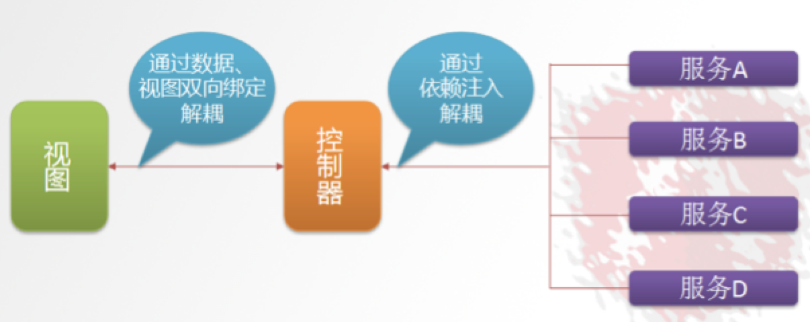

# 品优02—品牌管理

## 一、前端框架AngularJS入门

### 1.1、AngularJS简介

​	AngularJS  诞生于2009年，由Misko Hevery 等人创建，后为Google所收购。是一款优秀的前端JS框架，已经被用于Google的多款产品当中。AngularJS有着诸多特性，最为核心的是：MVC、模块化、自动化双向数据绑定、依赖注入等等。

由于AngularJS的不同版本变化很多，不是一种升级的形式存在。

但是目前企业使用的最多的是：1.0版本。所以本项目使用1.0版本做项目！


### 1.2、 AngularJS四大特征

- #### **MVC** 模式

  ​	Angular遵循软件工程的MVC模式,并鼓励展现，数据，和逻辑组件之间的松耦合.通过依赖注入（dependency injection），Angular为客户端的Web应用带来了传统服务端的服务，例如独立于视图的控制。 因此，后端减少了许多负担，产生了更轻的Web应用。

  

  - Model:数据,其实就是angular变量($scope.XX);

  - View: 数据的呈现,Html+Directive(指令);

  - Controller:操作数据,就是function,数据的增删改查;

  ````
     C---操作--->  M---双向---> V
                  M<---绑定--- V <---引入-- C
  ````

- #### 双向绑定

  ​	AngularJS是建立在这样的信念上的：即声明式编程应该用于构建用户界面以及编写软件构建，而指令式编程非常适合来表示业务逻辑。框架采用并扩展了传统HTML，通过双向的数据绑定来适应动态内容，双向的数据绑定允许模型和视图之间的自动同步。因此，AngularJS使得对DOM的操作不再重要并提升了可测试性。

- #### 依赖注入

  ​	依赖注入(Dependency Injection,简称DI)是一种设计模式, 指某个对象依赖的其他对象无需手工创建，只需要“吼一嗓子”，则此对象在创建时，其依赖的对象由框架来自动创建并注入进来,其实就是最少知识法则;模块中所有的service和provider两类对象，都可以根据形参名称实现DI。

- #### 模块化设计

  ##### 高内聚低耦合法则：

   - 高内聚：模块功能单一，所有关联模块的功能都集合在一个模块，而非相关的则不能出现；
   - 低耦合：模块与模块之间，少关联或依赖；

  ##### 1)官方提供的模块      ng(核心)、ngRoute、ngAnimate

  ##### 2)用户自定义的模块     angular.module('模块名',[ ])


### 1.3、AngularJS入门Demo

- ##### 表达式：{{表达式}}、ng-app 

  {{表达式}}：表达式可以是变量或是运算式；

  ng-app ：指令 作用是告诉子元素一下的指令是归angularJs的,angularJs会识别的，ng-app 指令定义了 AngularJS 应用程序的 根元素。

  ```html
  <head>
      ...
      <script src="js/angular.min.js"></script>
  </head>
  <body ng-app>
  	{{100+100}} <!--界面显示200-->
  </body>
  ```

- ##### 双向绑定：ng-model 

  指令用于绑定变量,这样用户在文本框输入的内容会绑定到变量上，而表达式可以实时地输出变量

  ```html
  <script type="text/javascript" src="js/angular.min.js"></script>
  <body ng-app>
  	请输入姓名：<input ng-model="myname">
  	<input ng-model="myname">
  	<hr>
  	{{myname}}
  </body>
  ```

- ##### 初始化指令：ng-init

  ```html
  <script type="text/javascript" src="js/angular.min.js"></script>
  <body ng-app ng-init="myname='rtytty'">
  	请输入姓名：<input ng-model="myname">
  	<input ng-model="myname">
  	<hr>
  	{{myname}}
  </body>
  ```

- ##### 控制器：ng-controller

  **scope：**使用贯穿整个 AngularJS App 应用,它与数据模型相关联,同时也是表达式执行的上下文。有了scope 就在视图和控制器之间建立了一个通道，基于作用域视图在修改数据时会立刻更新 scope，同样的scope 发生改变时也会立刻重新渲染视图。

  ```html
  <script type="text/javascript" src="js/angular.min.js"></script>
  <script >
  	var app = angular.module('myApp',[]); // 方块是引用其他模块，若有则添加
  	// 定义控制器	
  	app.controller('myController',function($scope){
  		$scope.add = function(){
  			return parseInt($scope.x)+parseInt($scope.y);
  		}
  	});
  </script>
  <body ng-app="myApp" ng-controller="myController">
  	第一个数:<input ng-model="x">    第二个数:<input ng-model="y">
  	<br>
  	结果：{{add()}}
  </body>
  ```

- ##### 事件指令：ng-click

  ```html
  <script >
  	var app = angular.module('myApp',[]); // 方块是引用其他模块，若有则添加
  	// 定义控制器	
  	app.controller('myController',function($scope){
  		$scope.add = function(){
  			$scope.z=parseInt($scope.x)+parseInt($scope.y);
  		}
  	});
  </script>
  <body ng-app="myApp" ng-controller="myController">
  	第一个数:<input ng-model="x">    第二个数:<input ng-model="y">
  	<br>
  	<button ng-click="add()">运算</button>
  	结果：{{z}}
  </body>
  ```

- ##### 循环数组/对象数组：ng-repeat

  ```html
  <script >
  	var app = angular.module('myApp',[]); // 方块是引用其他模块，若有则添加
  	// 定义控制器	
  	app.controller('myController',function($scope){
  		$scope.list = [100,192,203,65,789];
  	});
  	
  	app.controller('sController',function($scope){
  		$scope.entities = [ // 对象数组
  			{name:'张三',age:25,salary:1000.05},
  			{name:'李四',age:25,salary:6000.05},
  			{name:'王五',age:25,salary:1500.05},
  			{name:'风流',age:45,salary:20000.05}
  		];
  	});
  </script>
  <body ng-app="myApp">
  	<table ng-controller="myController">
  		<tr ng-repeat="x in list">
  			<td>{{x}}</td>
  		</tr>
  	</table>
  	<hr>
  	<table ng-controller="sController">
  		<tr>
  			<td>姓名</td>
  			<td>年龄</td>
  			<td>薪资</td>
  		</tr>
  		<tr ng-repeat="entity in entities">
  			<td>{{entity.name}}</td>
  			<td>{{entity.age}}</td>
  			<td>{{entity.salary}}</td>
  		</tr>
  	</table>
  </body>
  ```

- ##### 内置服务：$http 依赖注入

  ```html
  <script >
  	var app = angular.module('myApp',[]); // 方块是引用其他模块，若有则添加
  	// 定义控制器	
  	app.controller('myController',function($scope,$http){
  		$scope.findList = function(){
  			$http.get('data.json').success( // 其实际就是封装了ajax
  					function(response){
  						$scope.list = response;
  					}
  			);
  		}
  	});
  </script>
  <body ng-app="myApp" ng-controller="myController" ng-init="findList()">
  	<table>
  		<tr>
  			<td>姓名</td>
  			<td>数学</td>
  			<td>英语</td>
  		</tr>
  		<tr ng-repeat="entity in list">
  			<td>{{entity.name}}</td>
  			<td>{{entity.Math}}</td>
  			<td>{{entity.English}}</td>
  		</tr>
  	</table>
  </body>
  ```

  ```json
  # data.json
  [
  	{"name":"张三","Math":100,"English":93},
  	{"name":"李四","Math":88,"English":87},
  	{"name":"王五","Math":77,"English":56},
  	{"name":"赵六","Math":67,"English":86}
  ]
  ```

学完AngularJS，即应用完成品牌管理的增删改查功能！


## 二、品牌列表的实现 CRUD

- ### 品牌后端Service 服务--BrandServiceImpl

```java
@Service // 注意：com.alibaba.dubbo.config.annotation.Service;
public class BrandServiceImpl implements BrandService {

    @Autowired
    private TbBrandMapper brandMapper;

    /**
	 * 一次性查找所有品牌信息
	 */
    @Override
    public List<TbBrand> findAll() {
        return brandMapper.selectByExample(null);
    }

    /**
	 * 分页查询，不包括条件分页
	 */
    @Override
    public PagerInfo<TbBrand> findPage(Integer pageNum, Integer pageSize) {
        PageHelper.startPage(pageNum, pageSize);
        Page<TbBrand> page = (Page<TbBrand>) brandMapper.selectByExample(null);
        return new PagerInfo<>(page.getTotal(), page.getResult());
    }

    /**
	 * 添加
	 */
    @Override
    public void add(TbBrand brand) {
        brandMapper.insert(brand);
    }

    /**
	 * 依据主键id查询品牌，即查一个
	 */
    @Override
    public TbBrand findOne(Long id) {
        return brandMapper.selectByPrimaryKey(id);
    }

    /**
	 * 更新
	 */
    @Override
    public void update(TbBrand brand) {
        brandMapper.updateByPrimaryKey(brand);
    }

    /**
	 * 删除，依据主键集合
	 */
    @Override
    public void delete(Long[] ids) {
        for(Long id:ids) {
            brandMapper.deleteByPrimaryKey(id);
        }
    }

    /**
	 * 分页查询：包括了条件分页
	 * @param brand 为具体条件
	 */
    @Override
    public PagerInfo<TbBrand> findPage(TbBrand brand, Integer page, Integer size) {
        PageHelper.startPage(page, size);
        TbBrandExample example=new TbBrandExample();
        Criteria criteria = example.createCriteria();		
        if(brand!=null){
            if(brand.getName()!=null && brand.getName().length()>0){
                criteria.andNameLike("%"+brand.getName()+"%");
            }
            if(brand.getFirstChar()!=null && brand.getFirstChar().length()>0){
                criteria.andFirstCharEqualTo(brand.getFirstChar());
            }		
        }		
        Page<TbBrand> page= (Page<TbBrand>)brandMapper.selectByExample(example);	
        return new PagerInfo<TbBrand>(page.getTotal(), page.getResult());
    }
}
```

- ### 品牌后端Controller -- BrandController

```java
@RestController // 包含了@Controller @ResponseBody，省去方法添加
@RequestMapping("/brand")
public class BrandController {
	
	@Reference // com.alibaba.dubbo.config.annotation.Reference;
	private BrandService brandService;
	
	@RequestMapping("/findAll")
	public List<TbBrand> findAll(){
		return brandService.findAll();
	}
	
	@RequestMapping("/findPage")
	public PagerInfo<TbBrand> findPage(@RequestParam(name="page")Integer pageNum,
			@RequestParam(name="size")Integer pageSize) {
		return brandService.findPage(pageNum, pageSize);
	}
	
	@RequestMapping("/add")
	public Result add(@RequestBody TbBrand tbBrand) { // {"success":true,"message":"保存成功！"}
		try {
			brandService.add(tbBrand);
			return new Result( true,"增加成功！");
		} catch (Exception e) {
			e.printStackTrace();
			return new Result(false,"增加失败！");
		}
	}
	
	@RequestMapping("/findOne")
	public TbBrand findOne(Long id) {
		return brandService.findOne(id);
	}
	
	@RequestMapping("/update")
	public Result update(@RequestBody TbBrand brand) {
		try {
			brandService.update(brand);
			return new Result( true,"修改成功！");
		}catch (Exception e) {
			e.printStackTrace();
			return new Result( true,"修改失败！");
		}
	}
	
	@RequestMapping("/delete")
	public Result delete(Long[] ids) {
		try {
			brandService.delete(ids);
			return new Result( true,"删除成功！");
		}catch (Exception e) {
			e.printStackTrace();
			return new Result( true,"删除失败！");
		}
	}
	
	@RequestMapping("/search") // 若报nullPointer，查看页面传来的名称与controller对应的名称是否一致，若不一致，则要加注解@RequestParam说明名称
	public PagerInfo<TbBrand> search(@RequestBody TbBrand brand,@RequestParam(name="page")Integer pageNum,@RequestParam(name="size")Integer pageSize){
		return brandService.findPage(brand, pageNum, pageSize);
	}
}
```

- ### 品牌管理前端页面 -- brand.html

```html
<head>
	<script type="text/javascript" src="../plugins/angularjs/angular.min.js"></script>
	
	<!-- 分页组件开始 -->
	<script src="../plugins/angularjs/pagination.js"></script>
	<link rel="stylesheet" href="../plugins/angularjs/pagination.css">
	<!-- 分页组件结束 -->

    <script >
    	var app = angular.module('pinyougou',['pagination']); // 定义模块
    	app.controller('brandController',function($scope,$http){ // 定义控制器
    		$scope.findAll=function(){
    			$http.get('../brand/findAll.do').success(
    					function(response){
    						$scope.list=response;
    					}
    			);
    		}
    		
    		//重新加载列表 数据
    		$scope.reloadList=function(){
    			 //切换页码  
    			$scope.search( $scope.paginationConf.currentPage, $scope.paginationConf.itemsPerPage);
    		}

    		//分页控件配置 
    		$scope.paginationConf = {
    				 currentPage: 1,// 当前页
    				 totalItems: 10,// 总记录数
    				 itemsPerPage: 10,// 每页记录数
    				 perPageOptions: [10, 20, 30, 40, 50],// 分页数选项
    				 onChange: function(){// 当页码变更后，自动触发的方法
    				        	 $scope.reloadList();//重新加载, 首次也是通过这里加载数据的
    				 }
    		}
    		
    		//分页
    		$scope.findPage=function(page,size){	
    			$http.get('../brand/findPage.do?page='+page+'&size='+size).success(
    					function(response){
    						$scope.list=response.rows;	
    						$scope.paginationConf.totalItems=response.total;//更新总记录数
    					}			
    			);
    		}
    		
    		// 新增
    		$scope.save = function(){
    			var methodName = 'add';
    			if($scope.entity.id!=null){ // 方法1: 前端判断 ； 方法2: 直接在后端service层判断 id是否为null
    				methodName = 'update';
    			}
    			$http.post('../brand/'+methodName+'.do',$scope.entity).success(
    					function(response){
    						// alert(response);// ? object?? 记住，result实体类一定要设置get/set方法，否则Fastjson将无法自动转化成json
    						if(response.success){
    							$scope.reloadList(); // 刷新
    						}else{
    							alert(response.msg);
    						}
    					}
    			);
    		}
    		
    		// 查找一个
    		$scope.find = function(id){
    			$http.get('../brand/findOne.do?id='+id).success(
    					function(response){
    						$scope.entity = response;
    					}
    			);
    		}
    		
    		$scope.selectIds = []; // 用户勾选的id集合
    		
    		$scope.updateSelectIds = function($event,id){
    			if($event.target.checked){
    				$scope.selectIds.push(id);
    			}else{
    				var index = $scope.selectIds.indexOf(id);
    				$scope.selectIds.splice(index,1);// 移除的位子，后面的参数代表移除几个值
    			}
    		}
    		
    		$scope.del = function(){
    			$http.get('../brand/delete.do?ids='+$scope.selectIds).success(
    				function(response){
    					if(response.success){
							$scope.reloadList(); // 刷新
						}else{
							alert(response.msg);
						}
    				}		
    			);
    		}
    		
    		$scope.searchEntity = {}; // 初始化一个对象，防止非条件查询是，该对象为undefine
    		
    		$scope.search = function(page,size){
    			$http.post('../brand/search.do?page='+page+'&size='+size,$scope.searchEntity).success(
    					function(response){
    						$scope.list=response.rows;	
    						$scope.paginationConf.totalItems=response.total;//更新总记录数
    					}
    			);
    		}
    	});
    </script>
</head>
```