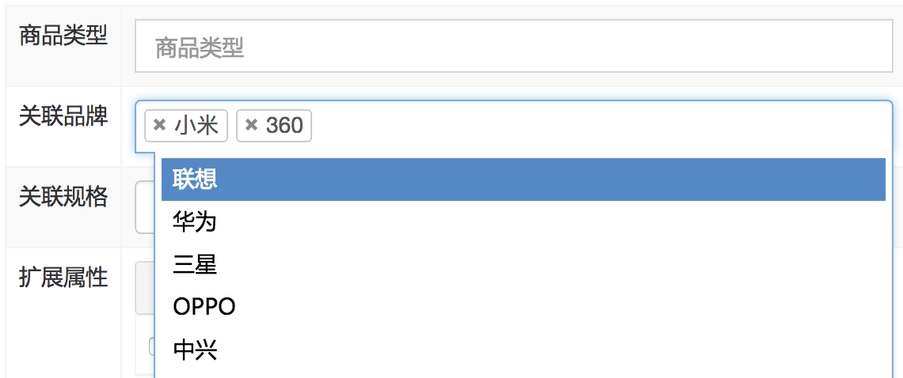

# 品优03--**规格及模板管理** 

## 一、前端分层 angularJS --MVC

#### 1.1、Module ： base.js / base-pagination.js

```js
var app = angular.module('pinyougou',['pagination']); // pagination设置
```

#### 1.2、Service：brandService.js

```js
app.service('brandService',function($http){
    		// 查询所有
    		this.findAll = function(){
    			return $http.get('../brand/findAll.do');
    		}
    		// 分页查询
    		this.findPage = function(page,size){
    			return $http.get('../brand/findPage.do?page='+page+'&size='+size);
    		}
    		// 新增
    		this.add = function(entity){
    			return $http.post('../brand/add.do',entity);
    		}
    		// 更新
    		this.update = function(entity){
    			return $http.post('../brand/update.do',entity);
    		}
    		
    		this.findOne = function(id){
    			return $http.get('../brand/findOne.do?id='+id);
    		}
    		
    		this.del = function(ids){
    			return $http.get('../brand/delete.do?ids='+ids);
    		}
    		
    		this.search = function(searchEntity,page,size){
    			return $http.post('../brand/search.do?page='+page+'&size='+size,searchEntity);
    		}
    	});
```

#### 1.3、Controller：brandController.js

```js
app.controller('brandController',function($scope,brandService){
    		$scope.findAll=function(){
    			brandService.findAll().success(
    					function(response){
    						$scope.list=response;
    					}
    			);
    		}

    		//分页控件配置 
    		$scope.paginationConf = {
    				 currentPage: 1,// 当前页
    				 totalItems: 10,// 总记录数
    				 itemsPerPage: 10,// 每页记录数
    				 perPageOptions: [10, 20, 30, 40, 50],// 分页数选项
    				 onChange: function(){// 当页码变更后，自动触发的方法
    				        	 $scope.reloadList();//重新加载, 首次也是通过这里加载数据的
    				 }
    		}
    		
    		//重新加载列表 数据
    		$scope.reloadList=function(){
    			 //切换页码  
    			$scope.search( $scope.paginationConf.currentPage, $scope.paginationConf.itemsPerPage);
    		}
    		
    		//分页
    		$scope.findPage=function(page,size){	
    			brandService.findPage(page.size).success(
    					function(response){
    						$scope.list=response.rows;	
    						$scope.paginationConf.totalItems=response.total;//更新总记录数
    					}			
    			);
    		}
    		
    		// 新增
    		$scope.save = function(){
    			var object;
    			if($scope.entity.id!=null){ // 方法1: 前端判断 ； 方法2: 直接在后端service层判断 id是否为null
    				object = brandService.update($scope.entity);
    			}else{
    				object = brandService.add($scope.entity);
    			}
    			object.success(
    					function(response){
    						// alert(response);// ? object?? 记住，result实体类一定要设置get/set方法，否则Fastjson将无法自动转化成json
    						if(response.success){
    							$scope.reloadList(); // 刷新
    						}else{
    							alert(response.msg);
    						}
    					}
    			);
    		}
    		
    		// 查找一个
    		$scope.findOne = function(id){
    			brandService.findOne(id).success(
    					function(response){
    						$scope.entity = response;
    					}
    			);
    		}
    		
    		$scope.selectIds = []; // 用户勾选的id集合
    		
    		$scope.updateSelectIds = function($event,id){
    			if($event.target.checked){
    				$scope.selectIds.push(id);
    			}else{
    				var index = $scope.selectIds.indexOf(id);
    				$scope.selectIds.splice(index,1);// 移除的位子，后面的参数代表移除几个值
    			}
    		}
    		
    		$scope.del = function(){
    			brandService.del($scope.selectIds).success(
    				function(response){
    					if(response.success){
							$scope.reloadList(); // 刷新
						}else{
							alert(response.msg);
						}
    				}		
    			);
    		}
    		
    		$scope.searchEntity = {}; // 初始化一个对象，防止非条件查询是，该对象为undefine
    		
    		$scope.search = function(page,size){
    			brandService.search($scope.searchEntity,page,size).success(
    					function(response){
    						$scope.list=response.rows;	
    						$scope.paginationConf.totalItems=response.total;//更新总记录数
    					}
    			);
    		}
    	});
```


## 二、控制器继承

- #### baseController.js

```js
//品牌控制层  抽离的baseController,其他控制器的公共部分
app.controller('baseController' ,function($scope){	
	
    //重新加载列表 数据
    $scope.reloadList=function(){
    	//切换页码  
    	$scope.search( $scope.paginationConf.currentPage, 	$scope.paginationConf.itemsPerPage);	   	
    }
    
	//分页控件配置 
	$scope.paginationConf = {
         currentPage: 1,
         totalItems: 10,
         itemsPerPage: 10,
         perPageOptions: [10, 20, 30, 40, 50],
         onChange: function(){
        	 $scope.reloadList();//重新加载
     	 }
	}; 
	
	$scope.selectIds=[];//选中的ID集合 

	//更新复选
	$scope.updateSelection = function($event, id) {		
		if($event.target.checked){//如果是被选中,则增加到数组
			$scope.selectIds.push( id);			
		}else{
			var idx = $scope.selectIds.indexOf(id);
            $scope.selectIds.splice(idx, 1);//删除 
		}
	}
	
	$scope.jsonToString=function(jsonString,key){
		var json= JSON.parse(jsonString);
		var value="";
		for(var i=0;i<json.length;i++){
			if(i>0){
				value+=",";
			}			
			value +=json[i][key];			
		}
		return value;
	}
});	
```

- 新的brandController.js

```js
app.controller('brandController',function($scope,$controller,brandService){

	$controller('baseController',{$scope:$scope}); // 继承，其实是一个伪继承，只是将scope传递
    
    $scope.findAll=function(){
		brandService.findAll().success(
				function(response){
					$scope.list=response;
				}
		);
	}
...
});
```


## 三、代码生成器

用于简化代码书写，具体软件及操作参考讲义！


## 四、规格管理 －－CRUD

#### 注意事项：

##### 1）新建/更新操作。 数据关联两个表tb_specification,tb_specification_option。此时需定义组合实体类。

##### 2）添加一条规格：由于组合实体，先插入tb_specification生成id，要在tb_specification_option使用生效。此时需要对生成的dao层做简单改装。

在insert语句添加`<selectKey>`，即生成的id返回给后面调用！

```xml
<insert id="insert" parameterType="com.pinyougou.pojo.TbSpecification" >
    <selectKey resultType="java.lang.Long" order="AFTER" keyProperty="id">
        SELECT LAST_INSERT_ID() AS id
    </selectKey>
    insert into tb_specification (id, spec_name)
    values (#{id,jdbcType=BIGINT}, #{specName,jdbcType=VARCHAR})
</insert>
```

##### 3）更新操作：更新规格选项是先根据规格的id进行删除操作，然后再按新传入的选项集合循环插入

```java
public void update(Specification specification){
    //保存修改的规格
    specificationMapper.updateByPrimaryKey(specification.getSpecification());//保存规格
    //删除原有的规格选项		
    TbSpecificationOptionExample example=new TbSpecificationOptionExample();
    com.pinyougou.pojo.TbSpecificationOptionExample.Criteria criteria = example.createCriteria();
    criteria.andSpecIdEqualTo(specification.getSpecification().getId());//指定规格ID为条件
    specificationOptionMapper.deleteByExample(example);//删除		
    //循环插入规格选项
    for(TbSpecificationOption specificationOption:specification.getSpecificationOptionList()){			
        specificationOption.setSpecId(specification.getSpecification().getId());
        specificationOptionMapper.insert(specificationOption);		
    }	
}	
```

##### 4）同样，删除规格，需要一并删除规格选项

```java
public void delete(Long[] ids) {
    for(Long id:ids){
        specificationMapper.deleteByPrimaryKey(id);			
        //删除原有的规格选项		
        TbSpecificationOptionExample example=new TbSpecificationOptionExample();
        com.pinyougou.pojo.TbSpecificationOptionExample.Criteria criteria = example.createCriteria();
        criteria.andSpecIdEqualTo(id);//指定规格ID为条件
        specificationOptionMapper.deleteByExample(example);//删除
    }		
}
```

##### 5）前端新增规格行

可以把新增行与规格选项数据进行双向绑定，如此操作就简单多了！

- 第一步：点击页面左上角新建按钮，初始化新建组合实体。即 $scope.entity={specificationOptionList:[]};

  而不能是$scope.entity.specificationOptionList=[]，因为这里面存在了两次初始化。

```html
<button type="button" class="btn btn-default" title="新建"
        data-toggle="modal" data-target="#editModal" ng-click="entity={specificationOptionList:[]}">
    <i class="fa fa-file-o"></i> 新建
</button>
```

- 第二步：在controller层，设置添加/删除规格选项行 方法

```js
//增加规格选项行
$scope.addTableRow=function(){
    $scope.entity.specificationOptionList.push({});			
}

//删除规格选项行
$scope.deleTableRow=function(index){
    $scope.entity.specificationOptionList.splice(index,1);
}
```

- 第三步：将specificationOptionList与页面view进行绑定

```html
<tbody>
    <tr ng-repeat="pojo in entity.specificationOptionList">
        <td><input class="form-control" placeholder="规格选项"
                   ng-model="pojo.optionName"></td>
        <td><input class="form-control" placeholder="排序"
                   ng-model="pojo.orders"></td>
        <td>
            <button type="button" class="btn btn-default" title="删除" ng-click="deleTableRow($index)">
                <i class="fa fa-trash-o"></i> 删除
            </button>
        </td>
    </tr>
</tbody>
```


## 五、模版管理－－CRUD

#### 5.1、Select2控件 (复选下拉框控件)



如上图的信息视觉效果！

若要使用上面的select2控件，操作如下：

1） 引入select2相关 js

```html
<link rel="stylesheet" href="../plugins/select2/select2.css" />
<link rel="stylesheet" href="../plugins/select2/select2-bootstrap.css" />
<script src="../plugins/select2/select2.min.js" type="text/javascript"></script>
```

2）通过angular.js调用select2，需要引入`angular-select2.js`。注意，由于是angular调用，那么该引入需要添加在module引入之后，即base.js之后。

```html
<script type="text/javascript" src="../js/angular-select2.js">  </script>
```

> 控件详情参考：angularjs-select2-master工程包


#### 5.2、前端字符串转json

由于后端传递到前端的数据，通过spring配置的转化器会自动转化为json。但是若这个传递json的本身value字符串又是一个json串。前端是无法识别这个json串的，而仅仅只是当作字符串看待。

此时，就需要在前端再次处理，才能转化为json对象。

在baseController.js中添加对应解析方法，如下：

```js
$scope.jsonToString=function(jsonString,key){
    var json= JSON.parse(jsonString);
    var value="";

    for(var i=0;i<json.length;i++){
        if(i>0){
            value+=",";
        }			
        value +=json[i][key];			
    }
    return value;
}
```


## 六、其他总结

#### 6.1、error summary:

```properties
error1:angular.min.js:80 Error: [ng:areq] http://errors.angularjs.org/1.2.9/ng/areq?p0=baseController&p1=not%20a%20function%2C%20got%20undefined

answer:如果在路由中引用了控制器而页面中没有使用控制器，angularjs会检查这种这种引用从而断言这是一个无效的引用，从而抛出一个Error: [ng:areq]的错误。
由于:<script type="text/javascript" src="../js/controller/brandController.js"></script>有父类继承controller，但是界面却没有导入！
```

```properties
error2:angular.min.js:2 Uncaught Error: [$injector:modulerr] http://errors.angularjs.org/1.2.9/$injector/modulerr?p0=pinyougou&p1=Error%... %2Fangular.min.js%3A28%3A232)

answer:报这种错误，一般都是依赖某个模块，但是在页面去没有导入。果然发现，依赖了分页pagination,但是却没有导入分页模块！
```

```properties
error3:java.lang.NoClassDefFoundError: org/apache/ibatis/session/RowBounds

answer:由于dubbox是发布服务然后由web层进行调用dubbox发布的服务的原因。web层是不会依赖于dao层的，因此查找了相关的资料发现是由于在web端引入了pagehelper插件,插件设置的方言为mysql,所以就找mybatis的资源.然而在web端根本用不到dao层的jar包.所以删除pagehelper即可.
　　我试着找了一下发现web层的pom文件中确实引入了pagehelper插件，现在想起来当初是因为控制台报错找不到pageHelper所以就引入了。但是后来发现在web层去掉pagehelper依赖后重启项目还是报错，所以尝试着把dao层中的mybatis的相关jar包都添加到web层后，重启项目后发现好了，控制台不报错了。
　　
总结:上述是一种解决法，但是不是很好。dubbo项目，web根本不需要依赖dao层，若加进来仅仅为了解决log中的警告得不偿失。所以，此种警告，可以忽略。  有时会有一种错觉，当数据没有超过8条时，根本就不会出现此警告。但也是数据在8条以下。
```

#### 6.2、html 断点调试：

第一步：F12 到前端控制台

第二步：source页面直接添加断点

第三步：页面操作，即可启动断点调试。F10，F11(上，下)，F9


