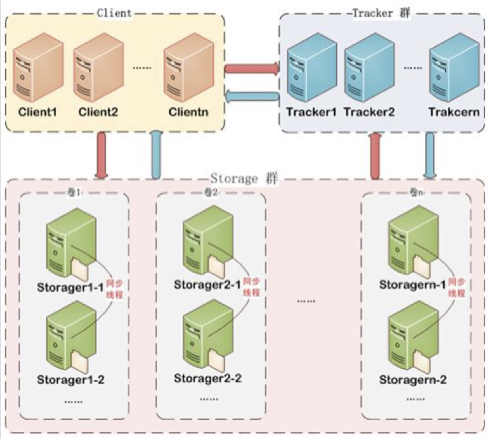
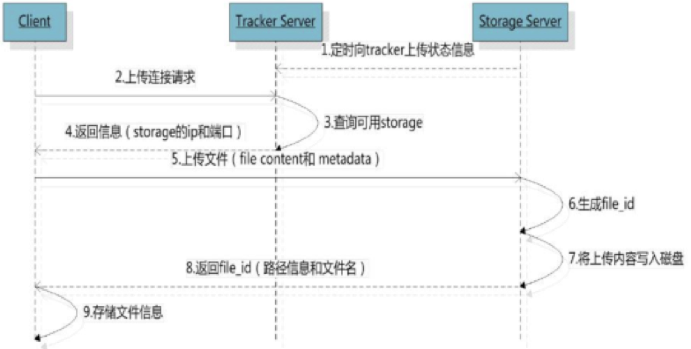
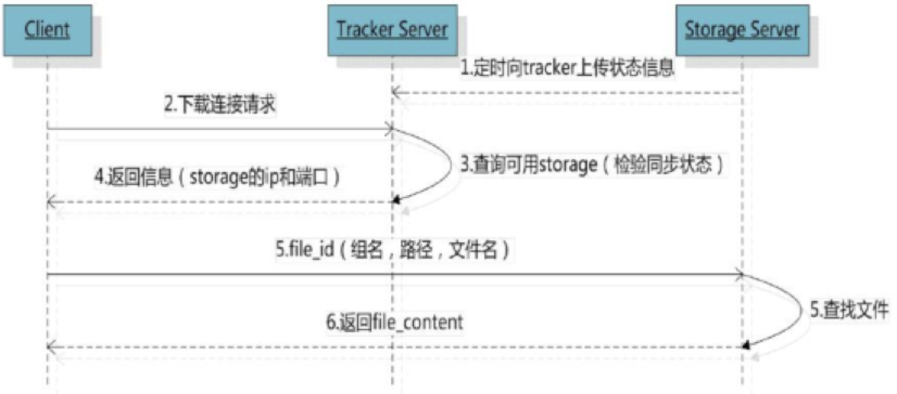

# 品优05_商品录入

## 一、商品分类

### 1.1、列表查询

这里分类是一个树形结构：3层！

开始的parentId ＝ 0；

```java
public List<TbItemCat> findByParentId(Long parentId) {
    TbItemCatExample example = new TbItemCatExample();
    TbItemCatExample.Criteria criteria = example.createCriteria();
    criteria.andParentIdEqualTo(parentId);
    return itemCatMapper.selectByExample(example);
}
```


### 1.2、面包屑导航

```
https://mvnrepository.com/artifact/javassist/javassist/3.11.0.GA -- maven中央仓库
```
```html
<ol class="breadcrumb">
    <li><a href="#" ng-click="grade=1;selectList({id:0})">顶级分类列表</a>
    </li>
    <li ng-if="grade==2||grade==3">
        <a href="#" ng-click="grade=2;selectList(entity_1)">{{entity_1.name}}</a>
    </li>
    <li ng-if="grade==3">
        <a href="#" ng-click="selectList(entity_2)">{{entity_2.name}}</a>
    </li>
</ol>
```

> 优化面包屑导航：上面会有bug， 因为ng-if判断，后在ng-click="grade=2"赋值就无效了。这样点击中间级查询，第三级导航不会消失，数据并错位！但是第一个ng-click="grade=1"，因没有走ng-if判断，所以她始终有效。
>
> 修改如下：
>
> ```html
> <li><a href="#" ng-click="grade=1;selectList({id:0})">顶级分类列表</a>
> </li>
> <li ng-if="grade==2||grade==3">
>     <a href="#" ng-click="setGrade(2);selectList(entity_1)">{{entity_1.name}}</a>
> </li>
> <li ng-if="grade==3">
>     <a href="#" ng-click="selectList(entity_2)">{{entity_2.name}}</a>
> </li>
> ```


### 1.3、商品分类的CRUD

- ##### 删除商品分类（学员实现）

（代码略） (注意：判断分类没有下级分类即可删除！)


## 二、电商概念及表结构分析

### 2.1、电商概念SPU与SKU

- ##### SPU = Standard Product Unit （标准产品单位）

  SPU是商品信息聚合的最小单位，是一组可复用、易检索的标准化信息的集合，该集合描述了一个产品的特性。通俗点讲，属性值、特性相同的商品就可以称为一个SPU。

  例如：iphone7就是一个SPU，与商家，与颜色、款式、套餐都无关。

- ##### SKU=stock keeping unit(库存量单位)

   SKU即库存进出计量的单位， 可以是以件、盒、托盘等为单位。
   SKU是物理上不可分割的最小存货单元。在使用时要根据不同业态，不同管理模式来处理。在服装、鞋类商品中使用最多最普遍。

  例如：纺织品中一个SKU通常表示：规格、颜色、款式。

##### SPU --- SKU: 1 --- N 的关系！

### 2.2表结构分析

tb-goods / tb-goods-desc: SPU

tb-item : SKU


## 三、商家后台-商品录入【基本功能】

### 3.1、在商家后台实现商品录入功能

包括商品名称、副标题、价格、包装列表、售后服务 几个简单选项！

```java
public class Goods implements Serializable {
	private TbGoods tgoods;
	private TbGoodsDesc goodsDesc;
	private List<TbItem> items;
	
	public TbGoods getTgoods() {
		return tgoods;
	}
	public void setTgoods(TbGoods tgoods) {
		this.tgoods = tgoods;
	}
	public TbGoodsDesc getGoodsDesc() {
		return goodsDesc;
	}
	public void setGoodsDesc(TbGoodsDesc goodsDesc) {
		this.goodsDesc = goodsDesc;
	}
	public List<TbItem> getItems() {
		return items;
	}
	public void setItems(List<TbItem> items) {
		this.items = items;
	}
}
```

```java
//  service层
public void add(Goods goods) {
    goods.getTgoods().setAuditStatus("0"); // 新增，未审核状态
    goodsMapper.insert(goods.getTgoods());	
    
	// 将tb_goods添加的纪录id返还回来给tb_goods_desc的good_id使用。 在dao层使用<selectKey>标签
    goods.getGoodsDesc().setGoodsId(goods.getTgoods().getId()); 
    goodsDescMapper.insert(goods.getGoodsDesc());
}
```

```java
// controller层
@RequestMapping("/add")
public Result add(@RequestBody Goods goods){
    // tb_goods的sellerId字段，即商家名称
    String sellerId = SecurityContextHolder.getContext().getAuthentication().getName();
    goods.getTgoods().setSellerId(sellerId);
    try {
        goodsService.add(goods);
        return new Result(true, "增加成功");
    } catch (Exception e) {
        e.printStackTrace();
        return new Result(false, "增加失败");
    }
}
```


## 四、商品录入 －－ 商品介绍

商品介绍录入：使用富文本编辑器。

### 4.1、富文本编辑器介绍

富文本编辑器，Rich Text Editor, 简称 RTE, 它提供类似于 Microsoft Word 的编辑功能。常用的富文本编辑器：

KindEditor  : `http://kindeditor.net/ `（国内优秀的富文本，本项目使用）

UEditor     : `http://ueditor.baidu.com/website/` (百度)

CKEditor   :  `http://ckeditor.com/` （国外）

### 4.2、富文本使用

```html
<!-- 富文本编辑器 css/js 引入-->
<link rel="stylesheet" href="../plugins/kindeditor/themes/default/default.css" />
<script charset="utf-8" src="../plugins/kindeditor/kindeditor-min.js"></script>
<script charset="utf-8" src="../plugins/kindeditor/lang/zh_CN.js"></script>

<!-- 富文本编辑器初始化-->
<script type="text/javascript">
	var editor;
	KindEditor.ready(function(K) {
		editor = K.create('textarea[name="content"]', { // 在对面view上，加上富文本控件
			allowFileManager : true
		});
	});
</script>
```

```js
$scope.add=function(){		
    $scope.entity.goodsDesc.introduction = editor.html(); // 提取富文本内容
    goodsService.add( $scope.entity  ).success(
        function(response){
            alert(response.msg);
            if(response.success){
                // 提示新增成功，并将页面的先前数据清空
                $scope.entity = {};
                editor.html(''); // 清空富文本内容
            }
        }		
    );				
}
```


## 五、分布式文件服务器FastDFS

解决海量数据存储问题。通过分布式服务器，存储文件。

### 5.1、什么是FastDFS （alibaba出品）

​	FastDFS 是用 c 语言编写的一款开源的分布式文件系统。FastDFS 为互联网量身定制，充分考虑了冗余备份、负载均衡、线性扩容等机制，并注重高可用、高性能等指标，使用 FastDFS很容易搭建一套高性能的文件服务器集群提供文件上传、下载等服务。

​	FastDFS 架构包括 Tracker server 和 Storage server。客户端请求 Tracker server 进行文件上传、下载，通过 Tracker server 调度最终由 Storage server 完成文件上传和下载。

​	Tracker server 作用是负载均衡和调度，通过 Tracker server 在文件上传时可以根据一些策略找到 Storage server 提供文件上传服务。可以将 tracker 称为追踪服务器或调度服务器。

​	Storage server 作用是文件存储，客户端上传的文件最终存储在 Storage 服务器上，Storageserver 没有实现自己的文件系统而是利用操作系统 的文件系统来管理文件。可以将storage称为存储服务器。



服务端两个角色：

Tracker：管理集群，tracker 也可以实现集群。每个 tracker 节点地位平等。收集 Storage 集群的状态。

Storage：实际保存文件   Storage 分为多个组，每个组之间保存的文件是不同的。每个组内部可以有多个成员，组成员内部保存的内容是一样的，组成员的地位是一致的，没有主从的概念。
>>>>>>> 60beca07b8bcb2c2cb8850f55438cb0914add13a


### 5.2、文件上传及下载的流程







客户端上传文件后存储服务器将文件 ID 返回给客户端，此文件 ID 用于以后访问该文件的索引信息。文件索引信息包括：组名／虚拟磁盘路径／数据两级目录／文件名。

```
group1   /M00      /02/44     /wKgZhVkMP4KAZEy-AAA-tCf93Fo973.jpg
组名   虚拟磁盘路径  数据两级目录    文件名
```

**组名**：文件上传后所在的 storage 组名称，在文件上传成功后有 storage 服务器返回，需要客户端自行保存。

 **虚拟磁盘路径**：storage 配置的虚拟路径，与磁盘选项 store_path*对应。如果配置了store_path0 则是 M00，如果配置了 store_path1 则是 M01，以此类推。

 **数据两级目录**：storage 服务器在每个虚拟磁盘路径下创建的两级目录，用于存储数据文件。

 **文件名**：与文件上传时不同。是由存储服务器根据特定信息生成，文件名包含：源存储服务器 IP 地址、文件创建时间戳、文件大小、随机数和文件拓展名等信息。


### 5.3、FastDFS安装 （参考文档，比较复杂）

现有的FastDFS最小镜像： root／itcast

### 5.4、FastDFS入门

##### 第一步：添加FastDFS客户端jar ／  fastdfs_client_v1.20.jar

```shell
# 由于此jar没有在中央仓库中，所以需要使用下列命令手动安装jar包到Maven本地仓库（将jar包放到d盘setup目录）课程配套的本地仓库已经有此jar包
$ mvn install:install-file -DgroupId=org.csource.fastdfs -DartifactId=fastdfs  -Dversion=1.2 -Dpackaging=jar -Dfile=d:\setup\fastdfs_client_v1.20.jar
```

```xml
<dependency>
    <groupId>org.csource.fastdfs</groupId>
    <artifactId>fastdfs</artifactId>
    <version>1.2</version>
</dependency>
```

##### 第二步：添加配置文件fdfs_client.conf

```properties
tracker_server=192.168.25.133:22122
```

##### 第三步：代码

```java
public static void main(String[] args) throws FileNotFoundException, IOException, Exception {
    // 1. 加载配置文件 /afastdfs-demo
    ClientGlobal.init("/Volumes/D/a-workspace/afastdfs-demo/src/main/resources/fdfs_client.conf");
    // 2. 构建一个管理者的客户端
    TrackerClient client = new TrackerClient();
    // 3. 连接管理者服务端
    TrackerServer trackerServer = client.getConnection();
    // 4. 声明存储服务端
    StorageServer storageServer = null;
    // 5. 创建一个 StorageClient 对象，需要两个参数 TrackerServer 对象、StorageServer 的引用
    StorageClient sClient = new StorageClient(trackerServer, storageServer);
    // 6. 使用 StorageClient 对象上传图片   /Volumes/C/lolo/01.png 
    String[] strings = sClient.upload_file("/Volumes/C/Pic/me.jpg", "jpg",null);
    // 7. 打印file_id字段，包含组名和图片的路径
    for(String s:strings){
        System.out.println(s);
    }
}
--------
group1
M00/00/00/wKgZhVyGFUSAe3LIAAXHbIk-G54554.jpg  
```

> ##### 注意： FastDFS服务器连不上，检查网络连接方式跟dobbo服务器连接方式是否一致，都为仅主机模式；
>
> 浏览：`http://192.168.25.133/group1/M00/00/00/wKgZhVyGFUSAe3LIAAXHbIk-G54554.jpg`


## 六、商家后台-商品录入【商品图片上传】

- ##### common.jar工程：依赖引入 、添加FastDFSClient.java 工具类拷贝到工程

```xml
<!-- 文件上传组件 -->
<dependency>
    <groupId>org.csource.fastdfs</groupId>
    <artifactId>fastdfs</artifactId>
</dependency>
<dependency> <!-- 浏览器上传-->
    <groupId>commons-fileupload</groupId>
    <artifactId>commons-fileupload</artifactId>
</dependency>	
```

- ##### 配置文件

```properties
# application.properties添加配置
FILE_SERVER_URL=http://192.168.25.133/
```

```xml
<!-- SpringMVC.xml 配置多媒体解析器 -->
<bean id="multipartResolver" class="org.springframework.web.multipart.commons.CommonsMultipartResolver">
		<property name="defaultEncoding" value="UTF-8"></property>
		<!-- 设定文件上传的最大值5MB，5*1024*1024 -->
		<property name="maxUploadSize" value="5242880"></property>
</bean>
```

- ##### uploadController

```java
@RequestMapping("/upload")
// controller层引入MultipartFile，springmvc配置多媒体解析器起到控制作用			
public Result upload( MultipartFile file){	
    try {
        //1、取文件的扩展名
      String originalFilename = file.getOriginalFilename();
      String extName = originalFilename.substring(originalFilename.lastIndexOf(".") + 1);
        //2、创建一个 FastDFS 的客户端
        FastDFSClient fastDFSClient  
            = new FastDFSClient("classpath:config/fdfs_client.conf");
        //3、执行上传处理
        String path = fastDFSClient.uploadFile(file.getBytes(), extName);
        //4、拼接返回的 url 和 ip 地址，拼装成完整的 url
        String url = FILE_SERVER_URL + path;			
        return new Result(true,url);			
    } catch (Exception e) {
        e.printStackTrace();
        return new Result(false, "上传失败");
    }		
}	
```

- ##### 前端

```js
app.service("uploadService",function($http){
	this.uploadFile=function(){
		var formData=new FormData();
	    formData.append("file",file.files[0]);   
		return $http({
            method:'POST',
            url:"../upload.do",
            data: formData,
            headers: {'Content-Type':undefined},
            transformRequest: angular.identity
        });		
	}	
});
```

> ##### 1、anjularjs对于post和get请求默认的Content-Type header 是application/json。通过设置‘Content-Type’: undefined，这样浏览器会帮我们把Content-Type 设置为 multipart/form-data.
>
> ##### 2、通过设置 transformRequest: angular.identity ，anjularjs transformRequest function 将序列化我们的formdata object.

 

