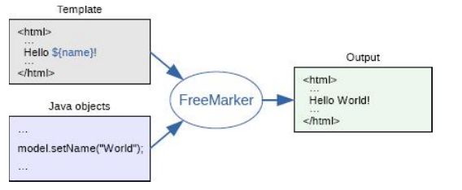

# 品优12_网页静态化解决方案-Freemarker

## 一、网页静态化技术Freemarker

### 1.1、网页静态化技术理解

网页静态化解决方案在实际开发中运用比较多，例如新闻网站，门户网站中的新闻频道或者是文章类的频道。 

##### 什么是网页静态化技术？ 就是事先依据数据库信息，生成相关的静态网页。这样当要访问相关页面的信息，直接拿静态网页即可，而不需要去访问数据库，从而减轻后台压力。

#### 作用：

##### 1、相当于缓存技术，都是减轻数据库的访问压力 ；

##### 2、网页静态化还有利于SEO ；

##### 3、可以使用Nginx这样的高性能的web服务器来部署。Nginx可以承载5万的并发，而Tomcat只有几百 ；


### 1.2、什么是 Freemarker 

FreeMarker 是一个用 Java 语言编写的模板引擎，它基于模板来生成文本输出。FreeMarker与 Web 容器无关，即在 Web 运行时，它并不知道 Servlet 或 HTTP。它不仅可以用作表现层的实现技术，而且还可以用于生成 XML，JSP 或 Java 等。 




### 1.3、Freemaker Demo

##### 第一步： 引入依赖

```
<dependency>
		<groupId>org.freemarker</groupId>
		<artifactId>freemarker</artifactId>
		<version>2.3.23</version>
</dependency> 
```

##### 第二步：创建模板文件 

模板文件中四种元素

  1、文本，直接输出的部分
   2、注释，即<#--...-->格式不会输出
   3、插值（Interpolation）：即${..}部分,将使用数据模型中的部分替代输出
   4、FTL指令：FreeMarker指令，和HTML标记类似，名字前加#予以区分，不会输出。

```
<html>
<head>
	<meta charset="utf-8">
	<title>Freemarker入门小DEMO </title>
</head>
<body>
<#--我只是一个注释，我不会有任何输出  -->
${name},你好。${message}
</body>
</html>
```

##### 第三步：生成文件 代码

```java
public static void main(String[] args) throws IOException, TemplateException {
    // 1.创建配置类
    Configuration configuration = new Configuration(Configuration.getVersion());
    // /freemarker-demo/src/main/resources/test.ftl
    String path  = FreemarkerTest.class.getClassLoader().getResource("test.ftl").getPath();
    System.out.println(path); // '/E:/e-workspace/freemarker-demo/target/classes/test.ftl'
    // 2.设置模板所在的目录
    configuration.setDirectoryForTemplateLoading(new File("E:/e-workspace/freemarker-demo/src/main/resources/"));
    // 3.设置字符集
    configuration.setDefaultEncoding("utf-8");
    // 4.加载模板
    Template template = configuration.getTemplate("test.ftl");
    // 5.创建数据模型
    Map map = new HashMap();
    map.put("name", "张三 ");
    map.put("message", "欢迎来到神奇的品优购世界！");
    // 6.创建Writer对象
    Writer out = new FileWriter(new File("e:/test_data/test.html"));
    // 7.输出
    template.process(map, out);
    // 8.关闭Writer对象
    out.close();
}
```


### 1.3、FTL指令 

- ##### assign指令 ： 此指令用于在页面上定义一个变量；

  ```
  <#assign linkman="周先生">
  联系人：${linkman}
  ```

- ##### include指令 

- #####  if指令 : 在freemarker的判断中，可以使用= 也可以使用==  

  ```xml
  <#if success=true> 
    你已通过实名认证
  <#else>  
    你未通过实名认证
  </#if>
  ```

  ```java
  // 在代码中对str变量赋值
  map.put("success", true);
  ```

- ##### list指令 ： 用于遍历集合

  ```xml
  List goodsList=new ArrayList();
  
  <#list goodsList as goods>
    ${goods_index+1} 商品名称： ${goods.name} 价格：${goods.price}<br>
  </#list>
  ```

- ##### 内建函数 

  内建函数语法格式： 变量+?+函数名称   

  ```js
  // 1. size函数：数组、集合大小统计
  共  ${goodsList?size}  条记录 
  
  // 2. eval函数：转换JSON字符串为对象
  <#assign text="{'bank':'工商银行','account':'10101920201920212'}" />
  <#assign data=text?eval />
  开户行：${data.bank}  账号：${data.account}
  
  // 3. 日期格式化 date系列函数
  dataModel.put("today", new Date());
  
  当前日期：${today?date} <br>
  当前时间：${today?time} <br>   
  当前日期+时间：${today?datetime} <br>        
  日期格式化：  ${today?string("yyyy年MM月")}
  
  // 4. c函数：数字转换为字符串
  map.put("point", 102920122);
  累计积分：${point}   // 结果： 102,920,122
  累计积分：${point?c} // 结果： 102920122
  ```

- ##### 空值处理运算符 

  ```js
  // 1. 判断某变量是否存在:“??”
  <#if aaa??>
    aaa变量存在
  <#else>
    aaa变量不存在
  </#if>
  
  // 2. 缺失变量默认值:“!”
  ${aaa!'-'}
  ```

- ##### 运算符 

  ```js
  // 1. FreeMarker表达式中完全支持算术运算,FreeMarker支持的算术运算符包括:+, - , * , / , %
  
  // 2. 逻辑运算符
  	逻辑运算符有如下几个: 
  		逻辑与:&& 
  		逻辑或:|| 
  		逻辑非:! 
  	逻辑运算符只能作用于布尔值,否则将产生错误 
  	
  // 3. 比较运算符
  	表达式中支持的比较运算符有如下几个: 
  		1  =或者==:判断两个值是否相等. 
  		2  !=:判断两个值是否不等. 
  		3  >或者gt:判断左边值是否大于右边值 
  		4  >=或者gte:判断左边值是否大于等于右边值 
  		5  <或者lt:判断左边值是否小于右边值 
  		6  <=或者lte:判断左边值是否小于等于右边值 
  
  注意:  =和!=可以用于字符串,数值和日期来比较是否相等,但=和!=两边必须是相同类型的值,否则会产生错误,而且FreeMarker是精确比较,"x","x ","X"是不等的.其它的运行符可以作用于数字和日期,但不能作用于字符串,大部分的时候,使用gt等字母运算符代替>会有更好的效果,因为 FreeMarker会把>解释成FTL标签的结束字符,当然,也可以使用括号来避免这种情况,如:<#if (x>y)> 
  ```


## 二、商品详情页-数据显示

### 2.1、页生成服务模块

​	因为页面生成：在运营商审核商品通过后，可以生成页面。 在其他地方也可能需要页面生成。而页面页面生成的具体步骤与其他模块又没有太多联系，所以新建一个页面生成服务。

#### pinyougou-page-service:

- applicationContext.xml文件配置 FreeMarkerConfigurer bean对象，即配置类；

```xml
<bean id="freemarkerConfig"
      class="org.springframework.web.servlet.view.freemarker.FreeMarkerConfigurer">
    <property name="templateLoaderPath" value="/WEB-INF/ftl/" />
    <property name="defaultEncoding" value="UTF-8" />
</bean>
```

- 后端代码

```java
@Service
public class ItemPageServiceImpl implements ItemPageService{
	
	@Autowired
	private FreeMarkerConfigurer freeMarkerConfigurer;
	
	@Value("${pagedir}")
	private String pagedir;
	
	@Autowired
	private TbGoodsMapper goodsMapper;
	
	@Autowired
	private TbGoodsDescMapper goodsDescMapper;
	
	@Autowired
	private TbItemCatMapper itemCatMapper;
	
	@Autowired
	private TbItemMapper itemMapper;
	
	@Override
	public boolean genItemHtml(Long goodsId) {
		
		Configuration configuration = freeMarkerConfigurer.getConfiguration();
		
		try {
			Template template = configuration.getTemplate("item.ftl");
			//创建数据模型
			Map<String,Object> dataModel=new HashMap<>();
			//1.商品主表数据
			TbGoods goods = goodsMapper.selectByPrimaryKey(goodsId);
			dataModel.put("goods", goods);
			//2.商品扩展表数据
			TbGoodsDesc goodsDesc = goodsDescMapper.selectByPrimaryKey(goodsId);
			dataModel.put("goodsDesc", goodsDesc);
			//3.读取商品分类
			
			String itemCat1 = itemCatMapper.selectByPrimaryKey(goods.getCategory1Id()).getName();
			String itemCat2 = itemCatMapper.selectByPrimaryKey(goods.getCategory2Id()).getName();
			String itemCat3 = itemCatMapper.selectByPrimaryKey(goods.getCategory3Id()).getName();
			dataModel.put("itemCat1", itemCat1);
			dataModel.put("itemCat2", itemCat2);
			dataModel.put("itemCat3", itemCat3);
			
			//4.读取SKU列表
			TbItemExample example=new TbItemExample();
			TbItemExample.Criteria criteria = example.createCriteria();
			criteria.andGoodsIdEqualTo(goodsId);//SPU ID
			criteria.andStatusEqualTo("1");//状态有效			
			example.setOrderByClause("is_default desc");//按是否默认字段进行降序排序，目的是返回的结果第一条为默认SKU
			
			List<TbItem> itemList = itemMapper.selectByExample(example);
			dataModel.put("itemList", itemList);
			
			Writer out=new FileWriter(pagedir+goodsId+".html");
			
			template.process(dataModel, out);//输出
			out.close();
			return true;
			
		} catch (Exception e) {
			// TODO Auto-generated catch block
			e.printStackTrace();
			return false;
		} 
	}
}
```

- ##### 运营商后端 :  在updateStatus添加对应的方法

```java
@RequestMapping("/updateStatus")
public Result updateStatus(Long[] ids,String status) {
    ...
}

@Reference(timeout=40000) // 给足生成静态网页时间
private ItemPageService itemPageService;
/**
	 * 生成静态页（测试）
	 * @param goodsId
	 */
@RequestMapping("/genHtml")
public void genHtml(Long goodsId){
    itemPageService.genItemHtml(goodsId);	
}
```

- ##### 生成的静态html 在 page.properties指定位置

```js
// 1. 此时的界面，是没有任何样式 即控制的。 所以我们要将 原静态原型的 样式等内容拿过来；

// 2. 然后，我们还需要添加自定义的js， 进行交互。 需要引入angularjs;
app.controller('itemController',function($scope){
	$scope.num = 1;
	//数量操作
	$scope.addNum=function(x){
		$scope.num=$scope.num+x;
		if($scope.num<1){
			$scope.num=1;
		}
	}	
	
	$scope.specificationItems={};//记录用户选择的规格
	//用户选择规格
	$scope.selectSpecification=function(name,value){	
		$scope.specificationItems[name]=value;
		searchSku(); // 读取sku
	}	
	//判断某规格选项是否被用户选中
	$scope.isSelected=function(name,value){
		if($scope.specificationItems[name]==value){
			return true;
		}else{
			return false;
		}		
	}

	$scope.sku={};// 当前选择的sku
	
	$scope.loadSku = function(){
		$scope.sku = skuList[0];
		$scope.specificationItems = JSON.parse(JSON.stringify($scope.sku.spec));
	}
	
	//匹配两个对象
	// map1 {"网络":"移动3G","机身内存":"32G"}
	// map2 {"网络":"移动3G","机身内存":"32G","颜色":"金色"}
	matchObject=function(map1,map2){		
		for(var k in map1){
			if(map1[k]!=map2[k]){
				return false;
			}			
		}
		for(var k in map2){
			if(map2[k]!=map1[k]){
				return false;
			}			
		}
		return true;		
	}

	//查询SKU
	searchSku=function(){
		for(var i=0;i<skuList.length;i++ ){
			if( matchObject(skuList[i].spec ,$scope.specificationItems ) ){
				$scope.sku=skuList[i];
				return ;
			}			
		}	
		$scope.sku={id:0,title:'--------',price:0};//如果没有匹配的		
	}
});

// 3. 对应页面的sku交互，我们不能每次去查询后台内容，而是通过js， 将数据事先与页面生成时全面拿过来。
<script>
    var skuList=[
        <#list itemList as item>
        {
        id:${item.id?c},
        title:'${item.title}',
        price:${item.price?c},
        spec:${item.spec}
        } ,
        </#list>   
    ];
</script>
```


