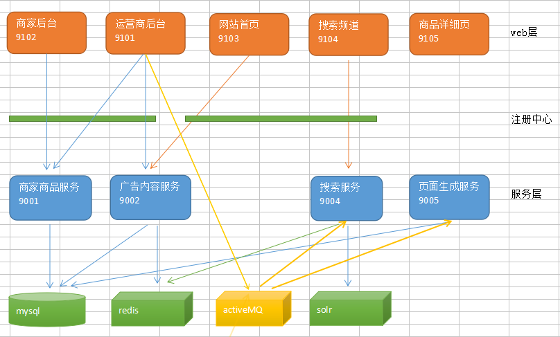
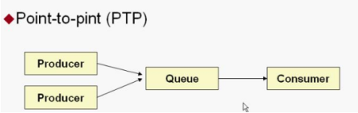
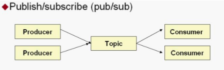
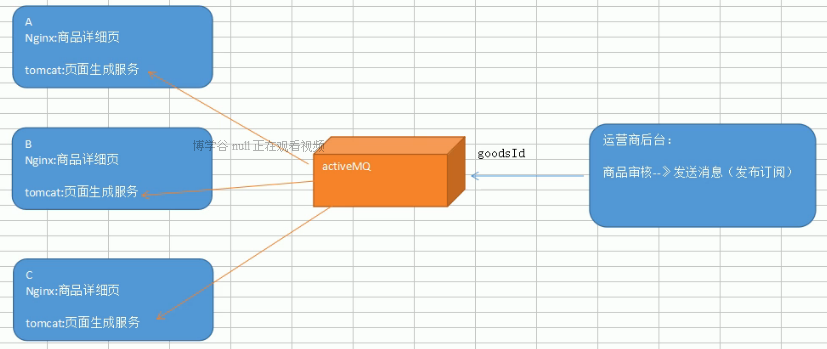

# 品优13_消息中间件解决方案JMS

## 一、 JMS入门 

### 1.1、消息中间件

​	我们已经完成了5个web模块和4个服务模块。其中运营商后台manager-web的调用关系最多，用到了商家商品服务、广告内容服务、搜索服务和页面生成服务。这种模块的依赖也称之为耦合。

​	而耦合越多，之后的维护工作就越困难。那么如果改善系统模块调用关系、减少模块之间的耦合呢？我们接下来就介绍一种解决方案----消息中间件。 

### 1.2、什么是消息中间件 

​	消息中间件利用高效可靠的消息传递机制进行平台无关的数据交流，并基于数据通信来进行分布式系统的集成。通过提供消息传递和消息排队模型，它可以在分布式环境下扩展进程间的通信。对于消息中间件，常见的角色大致也就有Producer（生产者）、Consumer（消费者）

常见的消息中间件产品:

- **ActiveMQ**

  ActiveMQ 是Apache出品，最流行的，能力强劲的开源消息总线。ActiveMQ 是一个完全支持JMS1.1和J2EE 1.4规范的 JMS Provider实现。我们在本次课程中介绍 ActiveMQ的使用。

- ##### RabbitMQ

  AMQP协议的领导实现，支持多种场景。淘宝的MySQL集群内部有使用它进行通讯，OpenStack开源云平台的通信组件，最先在金融行业得到运用。

- ##### ZeroMQ

  史上最快的消息队列系统;

- ##### Kafka

  Apache下的一个子项目 。特点：高吞吐，在一台普通的服务器上既可以达到10W/s的吞吐速率；完全的分布式系统。适合处理海量数据。


### 1.3、改造系统模块调用关系 



作用：

1） 完成解耦；

2）提升程序性能，因为服务直接调用占用主线程，而且调用的时间很长。

3）什么时候使用消息中间件？像 ”广告内容服务“、“商家商品服务” 能不能也用消息中间件呢？ 肯定不能，因为这两个服务，在调用者里还要返回值呢。


### 1.4、JMS简介

#### 1）什么是JMS

JMS（JavaMessaging Service）是Java平台上有关面向消息中间件的技术规范，它便于消息系统中的Java应用程序进行消息交换,并且通过提供标准的产生、发送、接收消息的接口简化企业应用的开发。

​       JMS本身只定义了一系列的接口规范，是一种与厂商无关的 API，用来访问消息收发系统。它类似于 JDBC(javaDatabase Connectivity)：这里，JDBC 是可以用来访问许多不同关系数据库的 API，而 JMS 则提供同样与厂商无关的访问方法，以访问消息收发服务。许多厂商目前都支持 JMS，包括 IBM 的 MQSeries、BEA的 Weblogic JMS service和 Progress 的 SonicMQ，这只是几个例子。 JMS 使您能够通过消息收发服务（有时称为消息中介程序或路由器）从一个 JMS 客户机向另一个 JML 客户机发送消息。消息是 JMS 中的一种类型对象，由两部分组成：报头和消息主体。报头由路由信息以及有关该消息的元数据组成。消息主体则携带着应用程序的数据或有效负载。

JMS 定义了五种不同的消息正文格式，以及调用的消息类型，允许你发送并接收以一

些不同形式的数据，提供现有消息格式的一些级别的兼容性。

##### · TextMessage--一个字符串对象

##### · MapMessage--一套名称-值对

##### · ObjectMessage--一个序列化的 Java 对象

##### · BytesMessage--一个字节的数据流

##### · StreamMessage -- Java 原始值的数据流


#### 2）JMS消息传递类型 

对于消息的传递有两种类型：

- ##### 一种是点对点的，即一个生产者和一个消费者一一对应；



​	这里并不是多个生产者对应一个消费者。而是通过队列，在一个时间里，一个producer 发的消息只有一个Consumer来消费；

- ##### 另一种是发布/ 订阅模式，即一个生产者产生消息并进行发送后，可以由多个消费者进行接收。




## 二、ActiveMQ下载与安装

官方网站下载：`http://activemq.apache.org` 的使用。

安装到Linux；

其他（略），参考讲义！


ActiveMQ 端口：8161

192.168.25.128:8161 即进入ActiveMQ界面

admin 、admin

## 三、JMS入门小Demo

### 3.1、点对点模式

​	点对点的模式主要建立在一个队列上面，当连接一个列队的时候，发送端不需要知道接收端是否正在接收，可以直接向ActiveMQ发送消息，发送的消息，将会先进入队列中，如果有接收端在监听，则会发向接收端，如果没有接收端接收，则会保存在activemq服务器，直到接收端接收消息，点对点的消息模式可以有多个发送端，多个接收端，但是一条消息，只会被一个接收端给接收到，哪个接收端先连上ActiveMQ，则会先接收到，而后来的接收端则接收不到那条消息。

- #### 消息的生产者

```java
public static void main(String[] args) throws JMSException {
    //1.创建连接工厂
    ConnectionFactory connectionFactory=new ActiveMQConnectionFactory("tcp://192.168.25.128:61616");
    //2.获取连接
    Connection connection = connectionFactory.createConnection();
    //3.启动连接
    connection.start();
    //4.获取session  (参数1：是否启动事务,参数2：消息确认模式)
    // •	AUTO_ACKNOWLEDGE = 1    自动确       •	CLIENT_ACKNOWLEDGE = 2    客户端手动确认   
    // •	DUPS_OK_ACKNOWLEDGE = 3    自动批量确认       •	SESSION_TRANSACTED = 0    事务提交并确认
    Session session = connection.createSession(false, Session.AUTO_ACKNOWLEDGE);		
    //5.创建队列对象
    Queue queue = session.createQueue("test-queue");
    //6.创建消息生产者
    MessageProducer producer = session.createProducer(queue);
    //7.创建消息
    TextMessage textMessage = session.createTextMessage("欢迎来到神奇的品优购世界11111");
    //8.发送消息
    producer.send(textMessage);
    //9.关闭资源
    producer.close();
    session.close();
    connection.close();
}
```

- #### 消息的消费者

```java
public static void main(String[] args) throws IOException, JMSException {
    //1.创建连接工厂
    ConnectionFactory connectionFactory=new ActiveMQConnectionFactory("tcp://192.168.25.128:61616");
    //2.获取连接
    Connection connection = connectionFactory.createConnection();
    //3.启动连接
    connection.start();
    //4.获取session  (参数1：是否启动事务,参数2：消息确认模式)
    Session session = connection.createSession(false, Session.AUTO_ACKNOWLEDGE);
    //5.创建队列对象
    Queue queue = session.createQueue("test-queue");
    //6.创建消息消费
    MessageConsumer consumer = session.createConsumer(queue);

    //7.监听消息
    consumer.setMessageListener(new MessageListener() {
        public void onMessage(Message message) {
            TextMessage textMessage=(TextMessage)message;
            try {
                System.out.println("接收到消息："+textMessage.getText());
            } catch (JMSException e) {
                // TODO Auto-generated catch block
                e.printStackTrace();
            }
        }
    });	
    //8.等待键盘输入
    System.in.read();	
    //9.关闭资源
    consumer.close();
    session.close();
    connection.close();	
}
```

> ##### 测试：同时开启2个以上的消费者，再次运行生产者，观察每个消费者控制台的输出，会发现只有一个消费者会接收到消息。 


### 3.2、发布/订阅模式（如同广播）

- #### 消息的生产者

  ``` java
  	// ...
  //4.获取session  (参数1：是否启动事务,参数2：消息确认模式)
   Session session = connection.createSession(false, Session.AUTO_ACKNOWLEDGE);
  //5.创建主题对象
  Topic topic = session.createTopic("test-topic");
  //6.创建消息生产者
  MessageProducer producer = session.createProducer(topic);
  	// ...
  ```

- #### 消息的消费者

  ```java
  //5.创建主题对象
  //Queue queue = session.createQueue("test-queue");
  Topic topic = session.createTopic("test-topic");
  ```

> ##### 同时开启2个以上的消费者，再次运行生产者，观察每个消费者控制台的输出，会发现每个消费者会接收到消息。 


## 四、Spring整合JMS

### 4.1、点对点模式 

- #### 消息的生产者

```java
@Component
public class QueueProducer {
	@Autowired
	private JmsTemplate jmsTemplate;
	
	@Autowired
	private Destination queueTextDestination;
	
	/**
	 * 发送文本消息
	 * @param text
	 */
	public void sendTextMessage(final String text){
		jmsTemplate.send(queueTextDestination, new MessageCreator() {			
			public Message createMessage(Session session) throws JMSException {
				return session.createTextMessage(text);
			}
		});		
	}
}
```

```xml
<?xml version="1.0" encoding="UTF-8"?>
<beans xmlns="http://www.springframework.org/schema/beans" xmlns:context="http://www.springframework.org/schema/context" xmlns:xsi="http://www.w3.org/2001/XMLSchema-instance" xmlns:amq="http://activemq.apache.org/schema/core"
	xmlns:jms="...">
	<context:component-scan base-package="com.itcast"></context:component-scan>     
    <!-- 真正可以产生Connection的ConnectionFactory，由对应的 JMS服务厂商提供-->  
	<bean id="targetConnectionFactory" class="org.apache.activemq.ActiveMQConnectionFactory">  
	    <property name="brokerURL" value="tcp://192.168.25.128:61616"/>  
	</bean>
	   
    <!-- Spring用于管理真正的ConnectionFactory的ConnectionFactory -->  
	<bean id="connectionFactory" class="org.springframework.jms.connection.SingleConnectionFactory">  
	<!-- 目标ConnectionFactory对应真实的可以产生JMS Connection的ConnectionFactory -->  
	    <property name="targetConnectionFactory" ref="targetConnectionFactory"/>  
	</bean>  
		   
    <!-- Spring提供的JMS工具类，它可以进行消息发送、接收等 -->  
	<bean id="jmsTemplate" class="org.springframework.jms.core.JmsTemplate">  
	    <!-- 这个connectionFactory对应的是我们定义的Spring提供的那个ConnectionFactory对象 -->  
	    <property name="connectionFactory" ref="connectionFactory"/>  
	</bean>      
    <!--这个是队列目的地，点对点的  文本信息-->  
	<bean id="queueTextDestination" class="org.apache.activemq.command.ActiveMQQueue">  
	    <constructor-arg value="queue_text"/>  
	</bean>    
</beans>
```

> ##### 由 JmsTemplate 发送消息，发送消息参数：参数目的地（Destination: spring 的ActiveMQQueue），消息体（MessageCreator: spring封装Message, Session对象）.

- #### 消息的消费者

```xml
<?xml version="1.0" encoding="UTF-8"?>
<beans xmlns="http://www.springframework.org/schema/beans" xmlns:context="http://www.springframework.org/schema/context" xmlns:xsi="http://www.w3.org/2001/XMLSchema-instance" xmlns:amq="http://activemq.apache.org/schema/core"
	xmlns:jms="...">
	
    <!-- 真正可以产生Connection的ConnectionFactory，由对应的 JMS服务厂商提供-->  
	<bean id="targetConnectionFactory" class="org.apache.activemq.ActiveMQConnectionFactory">  
	    <property name="brokerURL" value="tcp://192.168.25.128:61616"/>  
	</bean>
	   
    <!-- Spring用于管理真正的ConnectionFactory的ConnectionFactory -->  
	<bean id="connectionFactory" class="org.springframework.jms.connection.SingleConnectionFactory">  
	<!-- 目标ConnectionFactory对应真实的可以产生JMS Connection的ConnectionFactory -->  
	    <property name="targetConnectionFactory" ref="targetConnectionFactory"/>  
	</bean>  
	
    <!--这个是队列目的地，点对点的  文本信息-->  
	<bean id="queueTextDestination" class="org.apache.activemq.command.ActiveMQQueue">  
	    <constructor-arg value="queue_text"/>  
	</bean>    
	
	<!-- 我的监听类 -->
	<bean id="myMessageListener" class="com.itcast.MyMessageListener"></bean>
	
	<!-- 消息监听容器 -->
	<bean class="org.springframework.jms.listener.DefaultMessageListenerContainer">
		<property name="connectionFactory" ref="connectionFactory" />
		<property name="destination" ref="queueTextDestination" />
		<property name="messageListener" ref="myMessageListener" />
	</bean>
</beans>
```

```java
public class MyMessageListener implements MessageListener{
	public void onMessage(Message message) {
		TextMessage textMessage=(TextMessage)message;
		try {
			System.out.println("接收到消息："+textMessage.getText());
		} catch (JMSException e) {
			e.printStackTrace();
		}
	}
}
```


### 4.2、发布/订阅模式 : 

##### 基本上同点-点模式，差别就在 Destination的实现是 ActiveMQTopic。

```XML
<?xml version="1.0" encoding="UTF-8"?>
<beans xmlns="http://www.springframework.org/schema/beans" >
    .....
    <!--这个是队列目的地，点对点的  文本信息-->  
	<bean id="queueTextDestination" class="org.apache.activemq.command.ActiveMQQueue">  
	    <constructor-arg value="queue_text"/>  
	</bean>    
	
	<!--这个是订阅模式  文本信息-->  
	<bean id="topicTextDestination" class="org.apache.activemq.command.ActiveMQTopic">  
	    <constructor-arg value="topic_text"/>  
	</bean>  
	
</beans>
```

```java
@Component
public class TopicProducer {
		@Autowired
		private JmsTemplate template;
		
		@Autowired
		private Destination topicTextDestination;
		
		public void sendTextMessage( final String text) {
			template.send(topicTextDestination, new MessageCreator() {
				public Message createMessage(Session session) throws JMSException {
					return session.createTextMessage(text);
				}
			});
		}
}
```


## 五、商品审核-导入Solr索引库

项目：在spring的配置文件，对包的扫描。全部交给dubbo了。所以无需再另行配置`<context:component-scan.../>`。

##### Solr服务相当于一个缓存数据库是给SearchService共享使用的。即分布式布局多个SearchService是共享一个Solr。 那么，我们更新Solr是一次性操作，所以更新Solr索引是用点-点模式 的消息中间件。

首先可以解除 manager-web 对 search-service的依赖。

- #### 消息的生产者

```java
@Autowired
private JmsTemplate jmsTemplate;

@Autowired
private Destination queueSolrDestination; // 名称要与配置文件名称一致

@RequestMapping("/updateStatus")
public Result updateStatus(Long[] ids,String status) {
    ....
        //	searchService.importItemList(itemList); 被activeMQ替换
        // 为啥要转换了，因为List没有序列化，不能之间发这个
        final String jsonString = JSON.toJSONString(itemList); 

    jmsTemplate.send(queueSolrDestination, new MessageCreator() {
        @Override
        public Message createMessage(Session session) throws JMSException {
            return session.createTextMessage(jsonString);
        }
    });
    ...
}

@Autowired
private Destination queueSolrDeleteDestination;

@RequestMapping("/delete")
public Result delete(final Long [] ids){
    ...

        jmsTemplate.send(queueSolrDeleteDestination, new MessageCreator() {
            @Override
            public Message createMessage(Session session) throws JMSException {
                return session.createObjectMessage(ids);
            }
        });

    //			searchService.deleteByGoodIds(Arrays.asList(ids));
    ...
}
```

```XML
<?xml version="1.0" encoding="UTF-8"?>
<beans xmlns="http://www.springframework.org/schema/beans" >
	...
    <!--这个是队列目的地，点对点的  文本信息-->  
	<bean id="queueSolrDestination" class="org.apache.activemq.command.ActiveMQQueue">  
	    <constructor-arg value="pinyougou_queue_solr"/>  
	</bean>    
    
	<bean id="queueSolrDeleteDestination" class="org.apache.activemq.command.ActiveMQQueue"> 
	    <constructor-arg value="pinyougou_queue_solr_delete"/>  
	</bean>    
</beans>
```

- #### 消息的消费者

```xml
<?xml version="1.0" encoding="UTF-8"?>
<beans xmlns="http://www.springframework.org/schema/beans" >
	....
    <!--这个是队列目的地，点对点的  文本信息-->  
	<bean id="queueSolrDestination" class="org.apache.activemq.command.ActiveMQQueue">  
	    <constructor-arg value="pinyougou_queue_solr"/>  
	</bean>    
	<!-- update 消息监听容器 -->
	<bean id="solrMessageListenerContainer" class="org.springframework.jms.listener.DefaultMessageListenerContainer">
		<property name="connectionFactory" ref="connectionFactory" />
		<property name="destination" ref="queueSolrDestination" />
		<property name="messageListener" ref="itemSearchListener" /> <!-- 通过注解方式注入 -->
	</bean>
	
	 <!--这个是队列目的地，点对点的  文本信息-->  
	<bean id="queueSolrDeleteDestination" class="org.apache.activemq.command.ActiveMQQueue"> 
	    <constructor-arg value="pinyougou_queue_solr_delete"/>  
	</bean>    
	
	<!-- delete消息监听容器 -->
	<bean  class="org.springframework.jms.listener.DefaultMessageListenerContainer">
		<property name="connectionFactory" ref="connectionFactory" />
		<property name="destination" ref="queueSolrDeleteDestination" />
		<property name="messageListener" ref="itemDeleteListener" /> <!-- 通过注解方式注入 -->
	</bean>
</beans>
```

```java
@Component("itemSearchListener")
public class ItemSearchListener implements MessageListener{
    @Autowired
    private ItemSearchService itemSearchService;

    @Override
    public void onMessage(Message message) {
        System.out.println("监听接收到消息...");
        try {
            TextMessage textMessage=(TextMessage)message;
            String text = textMessage.getText();
            List<TbItem> list = JSON.parseArray(text,TbItem.class);
            for(TbItem item:list){
                System.out.println(item.getId()+" "+item.getTitle());
                //将spec字段中的json字符串转换为map
                Map specMap= JSON.parseObject(item.getSpec());
                item.setSpecMap(specMap);//给带注解的字段赋值
            }			
            itemSearchService.importItemList(list);//导入	
            System.out.println("成功导入到索引库");
        } catch (Exception e) {
            e.printStackTrace();
        }
    }
}


@Component("itemDeleteListener")
public class ItemDeleteListener implements MessageListener {
    @Autowired
    private ItemSearchService searchService;

    @Override
    public void onMessage(Message message) {
        try {
            ObjectMessage objectMessage = (ObjectMessage) message;
            Long[] ids = (Long[]) objectMessage.getObject();
            searchService.deleteByGoodIds(Arrays.asList(ids));
            System.out.println("成功删除索引库中的记录");	
        } catch (Exception e) {

        }
    }
}
```


## 六、商品删除-移除Solr索引库记录

参考上！


## 七、商品审核-执行网页静态化



##### 从上图分析，我们使用activeMQ优化网页静态化是一个发布订阅模式！


#### 具体操作步骤同 更新solr索引 ！！！

1、 由于 不需要page-web 这样的后台， 那么 page-service在dubbo注册的意义只是供 manager-web调用。然而此时，manager-web以优化以ActiveMQ 发消息来通知 page-service。 故 page-service注册到dubbo的意义不存在，可以先解除dubbo依赖；

2、 文件删除：

```java
new File(path).delete();
```


