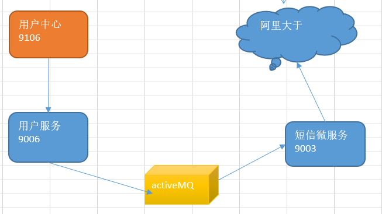

# 品优14_SpringBoot框架与短信解决方案

## 一、Spring Boot入门 

### 1.1、什么是Spring Boot ？

开发重量级的 Enterprise JavaBean（EJB）-->  Spring 为企业级Java 开发提供了一种相对简单的方法，通过依赖注入和面向切面编程，用简单的Java 对象（Plain Old Java Object，POJO）实现了 EJB 的功能。

前面我们用spring有几个缺点：

1） 配置xml， annotation代表了开发时的损耗。因为在思考 Spring 特性配置和解决业务问题之间需要进行思维切换，所以写配置挤占了写应用程序逻辑的时间。和所有框架一样，Spring 实用，但与此同时它要求的回报也不少。 

2）项目的依赖管理也是件吃力不讨好的事情。决定项目里要用哪些库就已经够让人头痛的了，你还要知道这些库的哪个版本和其他库不会有冲突，这难题实在太棘手。并且，依赖管理也是一种损耗，添加依赖不是写应用程序代码。一旦选错了依赖的版本，随之而来的不兼容问题毫无疑问会是生产力杀手。 

##### 那么该怎么办？ Spring Boot 让这一切成为了过去。 

#####  	Spring Boot 是 Spring 社区较新的一个项目。该项目的目的是帮助开发者更容易的创建基于 Spring 的应用程序和服务，让更多人的人更快的对 Spring 进行入门体验，为 Spring 生态系统提供了一种固定的、约定优于配置风格的框架。（即高度封装，简化业务层面开发！！！）

##### Spring Boot 具有如下特性：

（1）为基于 Spring 的开发提供更快的入门体验

（2）开箱即用，没有代码生成，也无需 XML 配置。同时也可以修改默认值来满足特定的需求。

（3）提供了一些大型项目中常见的非功能性特性，如嵌入式服务器、安全、指标，健康检测、外部配置等。

（4）Spring Boot 并不是不对 Spring 功能上的增强，而是提供了一种快速使用 Spring 的方式。


### 1.2、Spring Boot入门小Demo 

- #### （1）起步依赖  /  变更JDK版本  ： 默认是 1.6 jdk

```xml
<project xmlns="http://maven.apache.org/POM/4.0.0" 
	xsi:schemaLocation="http://maven.apache.org/POM/4.0.0 http://maven.apache.org/xsd/maven-4.0.0.xsd">
	<modelVersion>4.0.0</modelVersion>
	<groupId>cn.itcast.demo</groupId>
	<artifactId>springBootDemo</artifactId>
	<version>0.0.1-SNAPSHOT</version>
	<!-- 配置 properties 指定java.version 即变更jdk版本-->
	 <properties>   
    	<java.version>1.7</java.version>
     </properties>
	
	<parent>
		<groupId>org.springframework.boot</groupId>
		<artifactId>spring-boot-starter-parent</artifactId>
		<version>1.4.0.RELEASE</version>
	</parent>
	<dependencies>
		<dependency>
			<groupId>org.springframework.boot</groupId>
			<artifactId>spring-boot-starter-web</artifactId>
		</dependency>
	</dependencies>
</project>
```

> ##### 创建Spring Boot 任何工程只需jar packaging即可，即便是web工程。因为我们依赖了“spring-boot-starter-web”，其通过依赖传递，将tomcat嵌入项目中，执行jar即可以开启web工程。

- #### （2）引导类 

```java
@SpringBootApplication
public class Application {
	public static void main(String[] args) {
		SpringApplication.run(Application.class, args);
	}
}
```

> #### @SpringBootApplication其实就是以下三个注解的总和：
>
> @Configuration： 用于定义一个配置类；
>
> @EnableAutoConfiguration ：Spring Boot会自动根据你jar包的依赖来自动配置项目；
>
> @ComponentScan： packages 的用注解标识的类，会被spring自动扫描并且装入bean容器；

- #### （3）Spring MVC实现Hello World输出 

```java
@RestController
public class HelloWorldController {
	@RequestMapping("/info")
	public String info(){
		return "HelloWorld";		
	}	
}
```

> ##### 无需springMVC.xml ，web.xml 配置， 直接运行上面的引导类。即可通过localhost:8080/info访问到结果！

- #### （4）修改tomcat启动端口 

```properties
# 在src/main/resources下创建application.properties
server.port=8088
```

- #### （5）读取配置文件信息

```properties
# 在src/main/resources下的application.properties 增加配置
url=http://www.itcast.cn
```

```java
@RestController
public class HelloWorldController {
	@Autowired
	private Environment env;
	
	@RequestMapping("/info")
	public String info(){
		return "HelloWorld!   " + env.getProperty("url") ;		
	}	
}
```

- #### （6）热部署：实际就是自动重启spring-Boot

  在开发中反复修改类、页面等资源，每次修改后都是需要重新启动才生效，这样每次启动都很麻烦，浪费了大量的时间，能不能在我修改代码后不重启就能生效呢？可以，在pom.xml中添加如下配置就可以实现这样的功能，我们称之为热部署。 

  需要添加如下依赖：

```xml
<dependency>  
    <groupId>org.springframework.boot</groupId>  
    <artifactId>spring-boot-devtools</artifactId>  
</dependency>  
```


### 1.3、Spring Boot与ActiveMQ整合

- ##### 引入启动依赖

```xml
<dependency>
    <groupId>org.springframework.boot</groupId>
    <artifactId>spring-boot-starter-activemq</artifactId>
</dependency>
```

- ##### 生产者：

```java
@RestController
public class QueueController {

	@Autowired
	private JmsMessagingTemplate jmsMessagingTemplate;
	
	@RequestMapping("/send")
	public void send(String text){
		jmsMessagingTemplate.convertAndSend("itcast", text);
	}
	
	@RequestMapping("/sendMap")
	public void sendMap() {
		Map<String,Object> map=new HashMap<>();
		map.put("mobile", "13900001111");
		map.put("content", "恭喜获得10元代金券");		
		jmsMessagingTemplate.convertAndSend("itcast_map",map);
	}
}
```

- ##### 消费者：

```java
@Component
public class Consumer {

		@JmsListener(destination="itcast")
		public void readMessage(String text) {
			System.out.println("接收消息："+text);
		}
		
		@JmsListener(destination="itcast_map")
		public void readMessage(Map map) {
			System.out.println("接收Map消息："+map);
		}
}
```

> 默认情况，使用spring-boot嵌入的ActiveMQ。若要引用外部的ActiveMQ服务器，需要在application.properties配置如下：
>
> ```properties
> spring.activemq.broker-url=tcp://192.168.25.128:61616
> ```


## 二、短信发送平台-阿里大于

（适合开发测试使用，但是实际应用，可能会考虑免费的！但是免费的，可能不太靠谱！）

使用阿里大于， 需要添加连个SDK：

aliyun-java-sdk-core;

aliyun-java-sdk-dysmsapi;

由于这两个jar没有放入中央仓库，所以需要手动添加。

从官网下载对应语言版本的SDK：

<https://help.aliyun.com/document_detail/101874.html?spm=a2c4g.11186623.2.9.b81b5f307fgzdj> 

然后，添加到eclipse中，maven install 即是添加jar到本地仓库。


## 三、短信微服务

#### springBoot + ActiveMQ + 阿里大于 ： 实现短信微服务。

- ##### 消息监听者

```java
@Component
public class SmsListener {
	@Autowired
	private SmsUtil smsUtil;
	
    // activeMQ 接收到发短信消息，就调用SmsUtil进行短信的发送
	@JmsListener(destination="sms")
	public void sendSms(Map<String,String> map) { 
		try {
			SendSmsResponse response  = smsUtil.sendSms(
					map.get("mobile"), 
					map.get("template_code"),
					map.get("sign_name"),
					map.get("param"));
			
			System.out.println("Code=" + response.getCode());
	        System.out.println("Message=" + response.getMessage());
	        System.out.println("RequestId=" + response.getRequestId());
	        System.out.println("BizId=" + response.getBizId());		

		} catch (ClientException e) {
			e.printStackTrace();
		}
	}
}
```

```java
@Component
public class SmsUtil { // 就是阿里大于demo的 修正版

    // 产品名称:云通信短信API产品,开发者无需替换
    static final String product = "Dysmsapi";
    // 产品域名,开发者无需替换
    static final String domain = "dysmsapi.aliyuncs.com";

    @Autowired
    private Environment environment;

    // TODO 此处需要替换成开发者自己的AK(在阿里云访问控制台寻找)
    // static final String accessKeyId = "LTAI6cdHACoIbQU4";
    // static final String accessKeySecret = "wWhdVRmLeGIIVXw90XOs80rkrmjCha";

    public  SendSmsResponse sendSms(String mobile,String template_code,String sign_name,String param) throws ClientException {

        String accessKeyId =environment.getProperty("accessKeyId");
        String accessKeySecret = environment.getProperty("accessKeySecret");
        // 可自助调整超时时间
        System.setProperty("sun.net.client.defaultConnectTimeout", "10000");
        System.setProperty("sun.net.client.defaultReadTimeout", "10000");

        // 初始化acsClient,暂不支持region化
        IClientProfile profile = DefaultProfile.getProfile("cn-hangzhou", accessKeyId, accessKeySecret);
        DefaultProfile.addEndpoint("cn-hangzhou", "cn-hangzhou", product, domain);
        IAcsClient acsClient = new DefaultAcsClient(profile);

        // 组装请求对象-具体描述见控制台-文档部分内容
        SendSmsRequest request = new SendSmsRequest();
        // 必填:待发送手机号
        request.setPhoneNumbers(mobile);
        // 必填:短信签名-可在短信控制台中找到
        request.setSignName(sign_name);
        // 必填:短信模板-可在短信控制台中找到
        request.setTemplateCode(template_code);
        // 可选:模板中的变量替换JSON串,如模板内容为"亲爱的${name},您的验证码为${code}"时,此处的值为
        request.setTemplateParam(param);

        // 选填-上行短信扩展码(无特殊需求用户请忽略此字段)
        // request.setSmsUpExtendCode("90997");

        // 可选:outId为提供给业务方扩展字段,最终在短信回执消息中将此值带回给调用者
        request.setOutId("yourOutId");

        // hint 此处可能会抛出异常，注意catch
        SendSmsResponse sendSmsResponse = acsClient.getAcsResponse(request);

        return sendSmsResponse;
    }


    public  QuerySendDetailsResponse querySendDetails(String mobile,String bizId) throws ClientException {

        String accessKeyId =environment.getProperty("accessKeyId");
        String accessKeySecret = environment.getProperty("accessKeySecret");

        // 可自助调整超时时间
        System.setProperty("sun.net.client.defaultConnectTimeout", "10000");
        System.setProperty("sun.net.client.defaultReadTimeout", "10000");

        // 初始化acsClient,暂不支持region化
        IClientProfile profile = DefaultProfile.getProfile("cn-hangzhou", accessKeyId, accessKeySecret);
        DefaultProfile.addEndpoint("cn-hangzhou", "cn-hangzhou", product, domain);
        IAcsClient acsClient = new DefaultAcsClient(profile);

        // 组装请求对象
        QuerySendDetailsRequest request = new QuerySendDetailsRequest();
        // 必填-号码
        request.setPhoneNumber("15000000000");
        // 可选-流水号
        request.setBizId(bizId);
        // 必填-发送日期 支持30天内记录查询，格式yyyyMMdd
        SimpleDateFormat ft = new SimpleDateFormat("yyyyMMdd");
        request.setSendDate(ft.format(new Date()));
        // 必填-页大小
        request.setPageSize(10L);
        // 必填-当前页码从1开始计数
        request.setCurrentPage(1L);

        // hint 此处可能会抛出异常，注意catch
        QuerySendDetailsResponse querySendDetailsResponse = acsClient.getAcsResponse(request);

        return querySendDetailsResponse;
    }
}
```

> ##### springBoot 直接启动该短信微服务即可！ 我们通过其他服务，向activeMQ发消息，实现短信微服务！




## 四、用户注册 

##### 重点： 应该短信微服务实现 验证码校验功能。


### 4.1、发送短信验证码：

```java
@Override
public void createSmsCode(final String phone) {
    //1.生成一个6位随机数（验证码）
    final String smscode=  (long)(Math.random()*1000000)+"";
    System.out.println("验证码："+smscode);

    //2.将验证码放入redis
    redisTemplate.boundHashOps("smscode").put(phone, smscode);
    
    //3.将短信内容发送给activeMQ
    jmsTemplate.send(smsDestination, new MessageCreator() {

        @Override
        public Message createMessage(Session session) throws JMSException {
            MapMessage message = session.createMapMessage();
            message.setString("mobile", phone);//手机号
            message.setString("template_code", template_code);//验证码
            message.setString("sign_name", sign_name);//签名
            Map map=new HashMap();
            map.put("number", smscode);				
            message.setString("param", JSON.toJSONString(map));
            return message;
        }
    });
}
```


