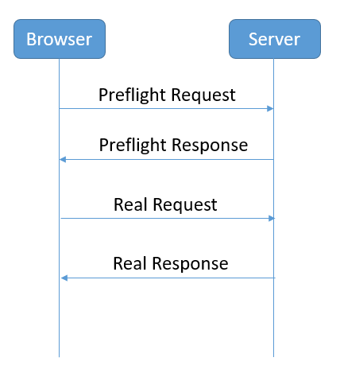

# 品优17_跨域解决方案与提交订单

## 一、商品详细页跨域请求 

### 1.1、跨域概念

##### 当两个应用的协议，主机IP地址（或域名）、端口其中有一项不同，就是说他们的域不同；

- #### JS跨域

##### 当两个不同域的应用a、b，用a的js去调用b的后端地址，即是JS跨域。


### 1.2、跨域调用测试

```js
//添加商品到购物车
$scope.addToCart=function(){
    $http.get('http://localhost:9107/cart/addGoodsIoCartList.do?itemId='
              +$scope.sku.id+'&num='+$scope.num).success(
        function(response){
            if(response.success){
                location.href='http://localhost:9107/cart.html';
            }else{
                alert(response.msg);
            }
        }
    );
}
```

测试后发现无法跨域调用

```shell
XMLHttpRequest cannot load http://localhost:9107/cart/addGoodsToCartList.do?itemId=112344&num=1. 

No 'Access-Control-Allow-Origin' header is present on the requested resource. Origin 'http://localhost:9100' is therefore not allowed access. The response had HTTP status code 400.
```


### 1.3、跨域解决方案CORS

​	CORS是一个W3C标准，全称是"跨域资源共享"（Cross-origin resource sharing）。CORS需要浏览器和服务器同时支持。目前，所有浏览器都支持该功能，IE浏览器不能低于IE10。**(实际就是W3C定义的跨域标准，只需要对应的请求头信息即可！)**

​	它允许浏览器向跨源服务器，发出XMLHttpRequest请求，从而克服了AJAX只能同源使用的限制。整个CORS通信过程，都是浏览器自动完成，不需要用户参与。对于开发者来说，CORS通信与同源的AJAX通信没有差别，代码完全一样。浏览器一旦发现AJAX请求跨源，就会自动添加一些附加的头信息，有时还会多出一次附加的请求，但用户不会有感觉。因此，实现CORS通信的关键是服务器。只要服务器实现了CORS接口，就可以跨源通信。



##### 改造pinyougou-cart-web的addGoodsToCartList方法：

```java
@RequestMapping("/addGoodsToCartList")
public Result addGoodsToCartList(Long itemId,Integer num){

    response.setHeader("Access-Control-Allow-Origin", "http://localhost:9105"); // 前面参数就是跨域响应头信息，后面参数指定IP可以跨域。若是全部 * 代替
    response.setHeader("Access-Control-Allow-Credentials", "true"); // 若跨域后，还需要对cookie操作，就要配置此相应头
    ...
        
}
```

##### springMVC的版本在4.2或以上版本，可以使用注解实现跨域, 我们只需要在需要跨域的方法上添加注解@CrossOrigin即可。

```java
// Spring 注解方式，封装更简单
@CrossOrigin(origins="http://localhost:9105",allowCredentials="true")
public Result addGoodsToCartList(Long itemId,Integer num){

    //response.setHeader("Access-Control-Allow-Origin", "http://localhost:9105"); 
    //response.setHeader("Access-Control-Allow-Credentials", "true"); 
    ...
}
```


## 二、结算页-收件人地址选择

- 地址信息是跟随 用户的，所以收件人地址服务，放到user-service最合适。
- 结算页，当然在cart-web前端。

```java
@Override
public List<TbAddress> findListByUserId(String userId) {

    TbAddressExample example=new TbAddressExample();
    Criteria criteria = example.createCriteria();
    criteria.andUserIdEqualTo(userId);
    return addressMapper.selectByExample(example);
}
```


## 三、结算页-支付方式选择 

参考讲义


## 四、结算页-商品清单与金额显示 

参考讲义


## 五、保存订单

### 5.1、为什么order表不让主键自增呢？

不自增，那么order表的主键如何产生？

对于互联网应用，可能某个表会占用很大的存储空间，让你服务器硬盘满了！！！

怎么办？ 数据库分片，把一个数据库进行拆分，通过数据库中间件进行连接！

##### 对于分片数据库 A、B、C，若使用主键自增，那么 A、B、C的主键肯定会重复，那么就无法实现数据库拆分技术！

解决方案：

#### 1、UUID: 可以使用，但不推荐。 缺点：1）太长；2）没办法排序；

#### 2、Redis: 产生自增的序号。缺点：主键的生成需要访问Redis，对redis有依赖；

#### 3、Oracle 数据库对象-序列（与表无关）。缺点：数据库通用性差，mysql行不通；

#### 4、程序自己写算法控制。缺点：自己写的算法要求高，要避免重复；

#### 5、推荐方案：分布式ID生成器；


### 5.2、分布式ID生成器

我们采用的是开源的twitter(  非官方中文惯称：推特.是国外的一个网站，是一个社交网络及微博客服务)  的snowflake算法。 （雪花算法）


- ##### 工作机器id(10):  组合一共可以生成（1024组值）

  ##### 	5位：数据中心id （0-31 32个数字） 相当于 数据库集群的组号

  ##### 	5位：机器id（0-31 32个数字） 相当于 某个数据库集群组下的数据库编码

​	上面两个概念只是一个相对概念。用来避免重复设计。

- ##### 12bit-序列号：是在对应时间戳（精确ms）,一次性生成的不同数字；若ms不同，序列号将重新计算；


### 5.3、新增订单

由于B-B-C网站，在下单时，由于选择的商品（多个），来自不同的商家，则会形成一次性下单，在数据库后台将会产生多个订单。

所以步骤参考如下：

```java
@Override
public void add(TbOrder order) {

    //1.从redis中提取购物车列表
    List<Cart> cartList= (List<Cart>) redisTemplate.boundHashOps("cartList").get(order.getUserId());

    //2.循环购物车列表添加订单
    for(Cart  cart:cartList){
        TbOrder tbOrder=new TbOrder();
        long orderId = idWorker.nextId();	//获取ID		
        tbOrder.setOrderId(orderId);
        tbOrder.setPaymentType(order.getPaymentType());//支付类型
        tbOrder.setStatus("1");//未付款 
        tbOrder.setCreateTime(new Date());//下单时间
        tbOrder.setUpdateTime(new Date());//更新时间
        tbOrder.setUserId(order.getUserId());//当前用户
        tbOrder.setReceiverAreaName(order.getReceiverAreaName());//收货人地址
        tbOrder.setReceiverMobile(order.getReceiverMobile());//收货人电话
        tbOrder.setReceiver(order.getReceiver());//收货人
        tbOrder.setSourceType(order.getSourceType());//订单来源
        tbOrder.setSellerId(order.getSellerId());//商家ID

        double money=0;//合计数
        //循环购物车中每条明细记录
        for(TbOrderItem orderItem:cart.getOrderItemList()  ){
            orderItem.setId(idWorker.nextId());//主键
            orderItem.setOrderId(orderId);//订单编号
            orderItem.setSellerId(cart.getSellerId());//商家ID
            orderItemMapper.insert(orderItem);				
            money+=orderItem.getTotalFee().doubleValue();
        }

        tbOrder.setPayment(new BigDecimal(money));//合计

        orderMapper.insert(tbOrder);
    }

    //3.清除redis中的购物车
    redisTemplate.boundHashOps("cartList").delete(order.getUserId());
}
```


