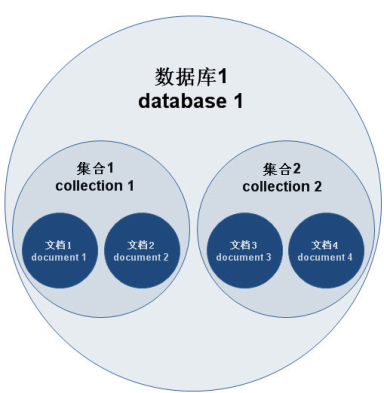

# 品优20_品优购系统业务分析

## 一、任务调度SpringTask

### 1.1、什么是任务调度

​	在企业级应用中，经常会制定一些“计划任务”，即在某个时间点做某件事情，核心是以时间为关注点，即在一个特定的时间点，系统执行指定的一个操作。常见的任务调度框架有【**Quartz】和【SpringTask**】等。


### 1.2 SpringTask入门小Demo

创建模块pinyougou-task-service,引入spring相关依赖 dao 和common工程，tomcat7端口为9108 。

添加配置文件applicationContext-task.xml  ,内容如下 :

```XML
<?xml version="1.0" encoding="UTF-8"?>
<beans xmlns="http://www.springframework.org/schema/beans"
       xmlns:xsi="http://www.w3.org/2001/XMLSchema-instance" xmlns:p="http://www.springframework.org/schema/p"
       xmlns:context="http://www.springframework.org/schema/context"
       xmlns:task="http://www.springframework.org/schema/task"	
       xsi:schemaLocation="http://www.springframework.org/schema/beans http://www.springframework.org/schema/beans/spring-beans.xsd
                           http://www.springframework.org/schema/context http://www.springframework.org/schema/context/spring-context.xsd
                           http://www.springframework.org/schema/task http://www.springframework.org/schema/task/spring-task-4.2.xsd">
    <context:component-scan base-package="com.pinyougou.task"/>
    <task:annotation-driven/>
</beans>
```

```java
@Component
public class SeckillTask {
	/**
	 * 刷新秒杀商品
	 */
	@Scheduled(cron="* * * * * ?")
	public void refreshSeckillGoods(){
		System.out.println("执行了任务调度"+new Date());		
	}		
}
```

> ##### Tomcat启动会，就会每隔1秒，执行refreshSeckillGoods()一次；


### 1.3 Cron表达式

- #### 1.3.1 Cron表达式格式 

  ##### Cron表达式是一个字符串，字符串以5或6个空格隔开，分为6或7个域，每一个域代表一个含义，Cron有如下两种语法格式： 

  （1）Seconds Minutes Hours DayofMonth Month DayofWeek Year

  （2）Seconds Minutes Hours DayofMonth Month DayofWeek

  ##### 每一个域可出现的字符如下： 

  ​	Seconds: 可出现", - * /"四个字符，有效范围为0-59的整数 

  ​	Minutes: 可出现", - * /"四个字符，有效范围为0-59的整数 

  ​	Hours: 可出现", - * /"四个字符，有效范围为0-23的整数 

  ​	DayofMonth: 可出现", - * / ? L W C"八个字符，有效范围为1-31的整数 

  ​	Month: 可出现", - * /"四个字符，有效范围为1-12的整数或JAN-DEc 

  ​	DayofWeek:可出现", - * / ? L C #"四个字符，有效范围为1-7的整数或SUN-SAT两个范围。1表示星期天，2表示星期一， 依次类推 

  ​	Year:可出现", - * /"四个字符，有效范围为1970-2099年

  ##### 每一个域都使用数字，但还可以出现如下特殊字符，它们的含义是： 

   **\* :** 表示匹配该域的任意值，假如在Minutes域使用*, 即表示每分钟都会触发事件。

   **? :** 只能用在DayofMonth和DayofWeek两个域。它也匹配域的任意值，但实际不会。因为DayofMonth和 DayofWeek会相互影响。例如想在每月的20日触发调度，不管20日到底是星期几，则只能使用如下写法： 13 13 15 20 * ?, 其中最后一位只能用？，而不能使用*，如果使用*表示不管星期几都会触发，实际上并不是这样。 

   **- :** 表示范围，例如在Minutes域使用5-20，表示从5分到20分钟每分钟触发一次 

   **/ :** 表示起始时间开始触发，然后每隔固定时间触发一次，例如在Minutes域使用5/20,则意味着5分钟触发一次，而25，45等分别触发一次. 

   **, :** 表示列出枚举值值。例如：在Minutes域使用5,20，则意味着在5和20分每分钟触发一次。 

   **L :** 表示最后，只能出现在DayofWeek和DayofMonth域，如果在DayofWeek域使用5L,意味着在最后的一个星期四触发。 

   **W :** 表示有效工作日(周一到周五)，只能出现在DayofMonth域，系统将在离指定日期的最近的有效工作日触发事件。例如：在 DayofMonth使用5W，如果5日是星期六，则将在最近的工作日：星期五，即4日触发。如果5日是星期天，则在6日(周一)触发；如果5日在星期一 到星期五中的一天，则就在5日触发。另外一点，W的最近寻找不会跨过月份 

   **LW :** 这两个字符可以连用，表示在某个月最后一个工作日，即最后一个星期五。 

   **\#:** 用于确定每个月第几个星期几，只能出现在DayofMonth域。例如在4#2，表示某月的第二个星期三。

- #### 1.3.2 Cron表达式例子

  0 0 10,14,16 * * ? 每天上午10点，下午2点，4点 

  0 0/30 9-17 * * ? 朝九晚五工作时间内每半小时 

  0 0 12 ? * WED 表示每个星期三中午12点 

  "0 0 12 * * ?" 每天中午12点触发 

  "0 15 10 ? * *" 每天上午10:15触发 

  "0 15 10 * * ?" 每天上午10:15触发 

  "0 15 10 * * ? *" 每天上午10:15触发 

  "0 15 10 * * ? 2005" 2005年的每天上午10:15触发 

  "0 * 14 * * ?" 在每天下午2点到下午2:59期间的每1分钟触发 

  "0 0/5 14 * * ?" 在每天下午2点到下午2:55期间的每5分钟触发 

  "0 0/5 14,18 * * ?" 在每天下午2点到2:55期间和下午6点到6:55期间的每5分钟触发 

  "0 0-5 14 * * ?" 在每天下午2点到下午2:05期间的每1分钟触发 

  "0 10,44 14 ? 3 WED" 每年三月的星期三的下午2:10和2:44触发 

  "0 15 10 ? * MON-FRI" 周一至周五的上午10:15触发 

  "0 15 10 15 * ?" 每月15日上午10:15触发 

  "0 15 10 L * ?" 每月最后一日的上午10:15触发 

  "0 15 10 ? * 6L" 每月的最后一个星期五上午10:15触发 

  "0 15 10 ? * 6L 2002-2005" 2002年至2005年的每月的最后一个星期五上午10:15触发 

  "0 15 10 ? * 6#3" 每月的第三个星期五上午10:15触发

##### 可以在线去生成Cron表达式！

### 1.4 秒杀商品列表的增量更新

前面只是一次读取数据库的秒杀进缓存。但是，我们的秒杀商品可能随时在变化呀！显示前面代码架构设计不太合理。 咋办？ 当然是我们使用定时任务来实现，秒杀商品更新到缓存。

##### 注意：这个更新缓存是一个增量更新过程！为啥呢？ 因为秒杀商品在操作过程是不会同步数据库的，若全部更新，岂不是也更新了数量，那就没完没了。 你要亏损多少Money呢？

```java
/**
 * 刷新秒杀商品
 */
@Scheduled(cron="0 * * * * ?") // 每分钟刷一次数据库到redis缓存
public void refreshSeckillGoods(){
    System.out.println("执行了任务调度"+new Date());			
    //查询所有的秒杀商品键集合
    List goodsIdList = new ArrayList( redisTemplate.boundHashOps("seckillGoods").keys());
    //查询正在秒杀的商品列表		
    TbSeckillGoodsExample example=new TbSeckillGoodsExample();
    Criteria criteria = example.createCriteria();
    criteria.andStatusEqualTo("1");//审核通过
    criteria.andStockCountGreaterThan(0);//剩余库存大于0
    criteria.andStartTimeLessThanOrEqualTo(new Date());//开始时间小于等于当前时间
    criteria.andEndTimeGreaterThan(new Date());//结束时间大于当前时间		
   if(goodsIdList.size()>0){
		criteria.andIdNotIn(goodsIdList);//排除缓存中已经存在的商品ID集合
	}	
    List<TbSeckillGoods> seckillGoodsList= seckillGoodsMapper.selectByExample(example);		
    //装入缓存 
    for( TbSeckillGoods seckill:seckillGoodsList ){
        redisTemplate.boundHashOps("seckillGoods").put(seckill.getId(), seckill);
    }
    System.out.println("将"+seckillGoodsList.size()+"条商品装入缓存");
}
```

### 1.5、过期秒杀商品的移除

##### 当前时间超过秒杀活动截止时间，那么就要删除秒杀商品的，即实际是清除redis的缓存数据！

```java
@Scheduled(cron="* * * * * ?") // 清除缓存，不操作数据库，那么间隔越快越好
public void removeSeckillGoods(){
    //查询出缓存中的数据，扫描每条记录，判断时间，如果当前时间超过了截止时间，移除此记录
    List<TbSeckillGoods> seckillGoodsList= redisTemplate.boundHashOps("seckillGoods").values();
    System.out.println("执行了清除秒杀商品的任务"+new Date());
    for(TbSeckillGoods seckillGoods :seckillGoodsList){
        if(seckillGoods.getEndTime().getTime() < new Date().getTime() ){
            //同步到数据库（清除缓存前，可能没有全部秒杀完，那么此时就得更新数据库）
            seckillGoodsMapper.updateByPrimaryKey(seckillGoods);				
            //清除缓存
            redisTemplate.boundHashOps("seckillGoods").delete(seckillGoods.getId());
            System.out.println("秒杀商品"+seckillGoods.getId()+"已过期");

        }			
    }		
    System.out.println("执行了清除秒杀商品的任务...end");
}
```


## 二、Maven Profile 

### 2.1、什么是MavenProfile

​	在我们平常的java开发中，会经常使用到很多配制文件（xxx.properties，xxx.xml），而当我们在本地开发（dev），测试环境测试（test），线上生产使用（product）时，需要不停的去修改这些配制文件，次数一多，相当麻烦。现在，利用maven的filter和profile功能，我们可实现在编译阶段简单的指定一个参数就能切换配制，提高效率，还不容易出错.

​	profile可以让我们定义一系列的配置信息，然后指定其激活条件。这样我们就可以定义多个profile，然后每个profile对应不同的激活条件和配置信息，从而达到不同环境使用不同配置信息的效果。

### 2.2、 Maven Profile入门

```xml
<properties> <!--  默认是9105-->
    <port>9105</port>
</properties>
<profiles>
  	<profile>
  		<id>dev</id>
  		<properties>
  			<port>9105</port>
  		</properties>
  	</profile>
  	<profile>
  		<id>pro</id>
  		<properties>
  			<port>9205</port>
  		</properties>
  	</profile>  
  </profiles>

 <build>  
	  <plugins>	     
	      <plugin>
				<groupId>org.apache.tomcat.maven</groupId>
				<artifactId>tomcat7-maven-plugin</artifactId>
				<version>2.2</version>
				<configuration>
					<!-- 指定端口 -->
					<port>${port}</port>
					<!-- 请求路径 -->
					<path>/</path>
				</configuration>
	  	  </plugin>
	  </plugins>  
    </build>
```

```properties
tomcat7:run -P dev ----> 9105端口
tomcat7:run -P pro ----> 9205端口
```


### 2.3、切换数据库连接配置

##### 1) 首先在dao工程的resources目录建一个filter文件(名字任意取，但要与build配置一致)，创建两个文件：

- db_dev.properties, 

```properties
env.jdbc.driver=com.mysql.jdbc.Driver
env.jdbc.url=jdbc:mysql://localhost:3306/pinyougoudb?characterEncoding=utf-8
env.jdbc.username=root
env.jdbc.password=root
```

- db_pro.properties.

```properties
env.jdbc.driver=com.mysql.jdbc.Driver
env.jdbc.url=jdbc:mysql://192.168.25.188:3306/pinyougoudb?characterEncoding=utf-8
env.jdbc.username=kill_mok
env.jdbc.password=&kk78$%o0u
```

- 对于原来的properties文件下的，db.properties修改为：

```properties
jdbc.driver=${env.jdbc.driver}
jdbc.url=${env.jdbc.url}
jdbc.username=${env.jdbc.username}
jdbc.password=${env.jdbc.password}
```

##### 2) 添加maven profiles 配置

```xml
<properties>
    <env>dev</env>
</properties>

<profiles>
    <profile>
        <id>dev</id>
        <properties>
            <env>dev</env>
        </properties>
    </profile>
    <profile>
        <id>pro</id>
        <properties>
            <env>pro</env>
        </properties>
    </profile>
</profiles>

<!-- 下面是过滤前面的新建filter文件夹的文件，配合上面profiles设置-->
<build>
    <filters>
        <filter>src/main/resources/filter/db_${env}.properties</filter>
    </filters>
    <resources>
        <resource>
            <directory>src/main/resources</directory>
            <filtering>true</filtering>
        </resource>
    </resources>
</build>
```

> 1. ##### 通过package -P pro : 打包成生产环境 ，package -P dev : 打包成测试环境；
>
> 2. ##### 当然也通过intall -P pro/dev 达成对应的jar给其他模块使用；


### 2.4、切换注册中心连接配置

每个关联dubbox的模块，也有手写地址。这样也很不方便生产/开发环境切换。

改造： 每个模块都依赖pinyougou-common模块。 那么就dubbo得注册地址写入commom模块。

##### 添加：applicationContext-dubbox.xml

```xml
<?xml version="1.0" encoding="UTF-8"?>
<beans xmlns="http://www.springframework.org/schema/beans"
	xmlns:xsi="http://www.w3.org/2001/XMLSchema-instance" ...>

   <!--  <dubbo:registry address="zookeeper://192.168.25.128:2181"/> -->
    <context:property-placeholder location="classpath*:properties/*.properties" />
    <dubbo:registry protocol="zookeeper"  address="${address}"/>
</beans>
```

其他步骤如同dao层改造！


## 三、MongoDB

ORM框架：Object Relation Mapping 对象关系映射， 如mybatis

### 3.1、什么是MongoDB

​	MongoDB 是一个跨平台的，面向文档的数据库，是当前 NoSQL 数据库产品中最热门的一种。它介于关系数据库和非关系数据库之间，是非关系数据库当中功能最丰富，最像关系数据库的产品。它支持的数据结构非常松散，是类似JSON  的 BSON 格式，因此可以存储比较复杂的数据类型。

MongoDB 的官方网站地址是：<http://www.mongodb.org/>

### 3.2 MongoDB特点

MongoDB 最大的特点是他支持的查询语言非常强大，其语法有点类似于面向对象的查询语言，几乎可以实现类似关系数据库单表查询的绝大部分功能，而且还支持对数据建立索引。它是一个面向集合的,模式自由的文档型数据库。

具体特点总结如下：

（1）面向集合存储，易于存储对象类型的数据

（2）模式自由

（3）支持动态查询

（4）支持完全索引，包含内部对象

（5）支持复制和故障恢复

（6）使用高效的二进制数据存储，包括大型对象（如视频等）

（7）自动处理碎片，以支持云计算层次的扩展性

（8）支持 Python，PHP，Ruby，Java，C，C#，Javascript，Perl 及 C++语言的驱动程序，社区中也提供了对 Erlang 及.NET 等平台的驱动程序

（9） 文件存储格式为 BSON（一种 JSON 的扩展）

#### 总结：在架构设计时，什么情况使用mongoDB?

1） 数据量很大时，对数据库频繁写入；

2） 数据价值不高时，使用MongoDB。 如评价，收藏，足迹或日志等；相反，如订单，商品就要用关系型数据库； 

##### 为啥MongoDB快呢？ 因为MongoDB没有事务，直接读写， 比关系数据库要快；但对比redis，也是noSQL， 还是要慢些，因为redis是纯内存，而MongoDB是写在磁盘中；


### 3.3 MongoDB体系结构

MongoDB 的逻辑结构是一种层次结构。主要由：

文档(document)、集合(collection)、数据库(database)这三部分组成的。逻辑结构是面向用户

的，用户使用 MongoDB 开发应用程序使用的就是逻辑结构。

（1）MongoDB 的文档（document），相当于关系数据库中的一行记录。

（2）多个文档组成一个集合（collection），相当于关系数据库的表。

（3）多个集合（collection），逻辑上组织在一起，就是数据库（database）。

（4）一个 MongoDB 实例支持多个数据库（database）。

文档(document)、集合(collection)、数据库(database)的层次结构如下图:



下表是MongoDB与MySQL数据库逻辑结构概念的对比

| MongoDb           | 关系型数据库Mysql |
| ----------------- | ----------------- |
| 数据库(databases) | 数据库(databases) |
| 集合(collections) | 表(table)         |
| 文档(document)    | 行(row)           |


