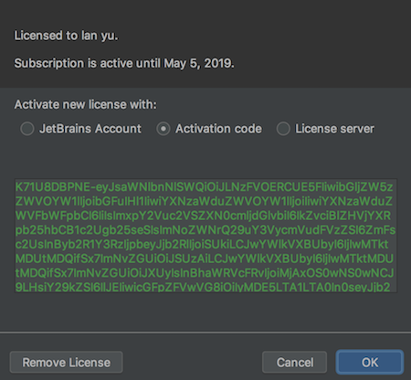

# IntelliJ IDEA 破解

##### 第一步：首先下载Intellij，安装好intelliJ IDEA。

##### 第二步：打开IntelliJ IDEA 注册码 网站 －－http://idea.lanyus.com/

##### 第三步：windows版，需要下载JetbrainsCrack-3.1-release-enc.jar，放到放在 idea安装目录的bin目录下；（Mac OS不需要）

##### 第四步：windows版，编辑’ idea64.exe.vmoptions’ 文件 注意:如果电脑是32位的请编辑 “idea.exe.vmoptions”。

在文件末尾添加如下内容 注意: D:\delevelop\IntelliJ IDEA 2018.2.1\bin 为IDEA的安装路径.请根据自身的安装路径填写：-javaagent:D:\delevelop\IntelliJ IDEA 2018.2.1\bin\JetbrainsCrack-3.1-release-enc.jar；

（Mac不需）

##### 第五步，将“0.0.0.0 account.jetbrains.com”添加到hosts文件中，打开编辑器，在最后一行添加‘0.0.0.0 account.jetbrains.com’。（Mac也需要）

```
Mac OS 如何找到hosts：
1. 打开Finder，command＋shift＋G弹出搜索框，输入 /etc/hosts即可
2. 终端：open /etc/hosts

但是，hosts文件是没有权限修改的！需要修改etc文件的权限先，默认只有读，修改为读写权限；(需要管理员密码)
```

##### 第六步：在IntelliJ IDEA 注册码 网站，点击获取注册码；

```
K71U8DBPNE-eyJsaWNlbnNlSWQiOiJLNzFVOERCUE5FIiwibGljZW5zZWVOYW1lIjoibGFuIHl1IiwiYXNzaWduZWVOYW1lIjoiIiwiYXNzaWduZWVFbWFpbCI6IiIsImxpY2Vuc2VSZXN0cmljdGlvbiI6IkZvciBlZHVjYXRpb25hbCB1c2Ugb25seSIsImNoZWNrQ29uY3VycmVudFVzZSI6ZmFsc2UsInByb2R1Y3RzIjpbeyJjb2RlIjoiSUkiLCJwYWlkVXBUbyI6IjIwMTktMDUtMDQifSx7ImNvZGUiOiJSUzAiLCJwYWlkVXBUbyI6IjIwMTktMDUtMDQifSx7ImNvZGUiOiJXUyIsInBhaWRVcFRvIjoiMjAxOS0wNS0wNCJ9LHsiY29kZSI6IlJEIiwicGFpZFVwVG8iOiIyMDE5LTA1LTA0In0seyJjb2RlIjoiUkMiLCJwYWlkVXBUbyI6IjIwMTktMDUtMDQifSx7ImNvZGUiOiJEQyIsInBhaWRVcFRvIjoiMjAxOS0wNS0wNCJ9LHsiY29kZSI6IkRCIiwicGFpZFVwVG8iOiIyMDE5LTA1LTA0In0seyJjb2RlIjoiUk0iLCJwYWlkVXBUbyI6IjIwMTktMDUtMDQifSx7ImNvZGUiOiJETSIsInBhaWRVcFRvIjoiMjAxOS0wNS0wNCJ9LHsiY29kZSI6IkFDIiwicGFpZFVwVG8iOiIyMDE5LTA1LTA0In0seyJjb2RlIjoiRFBOIiwicGFpZFVwVG8iOiIyMDE5LTA1LTA0In0seyJjb2RlIjoiR08iLCJwYWlkVXBUbyI6IjIwMTktMDUtMDQifSx7ImNvZGUiOiJQUyIsInBhaWRVcFRvIjoiMjAxOS0wNS0wNCJ9LHsiY29kZSI6IkNMIiwicGFpZFVwVG8iOiIyMDE5LTA1LTA0In0seyJjb2RlIjoiUEMiLCJwYWlkVXBUbyI6IjIwMTktMDUtMDQifSx7ImNvZGUiOiJSU1UiLCJwYWlkVXBUbyI6IjIwMTktMDUtMDQifV0sImhhc2giOiI4OTA4Mjg5LzAiLCJncmFjZVBlcmlvZERheXMiOjAsImF1dG9Qcm9sb25nYXRlZCI6ZmFsc2UsImlzQXV0b1Byb2xvbmdhdGVkIjpmYWxzZX0=-Owt3/+LdCpedvF0eQ8635yYt0+ZLtCfIHOKzSrx5hBtbKGYRPFDrdgQAK6lJjexl2emLBcUq729K1+ukY9Js0nx1NH09l9Rw4c7k9wUksLl6RWx7Hcdcma1AHolfSp79NynSMZzQQLFohNyjD+dXfXM5GYd2OTHya0zYjTNMmAJuuRsapJMP9F1z7UTpMpLMxS/JaCWdyX6qIs+funJdPF7bjzYAQBvtbz+6SANBgN36gG1B2xHhccTn6WE8vagwwSNuM70egpahcTktoHxI7uS1JGN9gKAr6nbp+8DbFz3a2wd+XoF3nSJb/d2f/6zJR8yJF8AOyb30kwg3zf5cWw==-MIIEPjCCAiagAwIBAgIBBTANBgkqhkiG9w0BAQsFADAYMRYwFAYDVQQDDA1KZXRQcm9maWxlIENBMB4XDTE1MTEwMjA4MjE0OFoXDTE4MTEwMTA4MjE0OFowETEPMA0GA1UEAwwGcHJvZDN5MIIBIjANBgkqhkiG9w0BAQEFAAOCAQ8AMIIBCgKCAQEAxcQkq+zdxlR2mmRYBPzGbUNdMN6OaXiXzxIWtMEkrJMO/5oUfQJbLLuMSMK0QHFmaI37WShyxZcfRCidwXjot4zmNBKnlyHodDij/78TmVqFl8nOeD5+07B8VEaIu7c3E1N+e1doC6wht4I4+IEmtsPAdoaj5WCQVQbrI8KeT8M9VcBIWX7fD0fhexfg3ZRt0xqwMcXGNp3DdJHiO0rCdU+Itv7EmtnSVq9jBG1usMSFvMowR25mju2JcPFp1+I4ZI+FqgR8gyG8oiNDyNEoAbsR3lOpI7grUYSvkB/xVy/VoklPCK2h0f0GJxFjnye8NT1PAywoyl7RmiAVRE/EKwIDAQABo4GZMIGWMAkGA1UdEwQCMAAwHQYDVR0OBBYEFGEpG9oZGcfLMGNBkY7SgHiMGgTcMEgGA1UdIwRBMD+AFKOetkhnQhI2Qb1t4Lm0oFKLl/GzoRykGjAYMRYwFAYDVQQDDA1KZXRQcm9maWxlIENBggkA0myxg7KDeeEwEwYDVR0lBAwwCgYIKwYBBQUHAwEwCwYDVR0PBAQDAgWgMA0GCSqGSIb3DQEBCwUAA4ICAQC9WZuYgQedSuOc5TOUSrRigMw4/+wuC5EtZBfvdl4HT/8vzMW/oUlIP4YCvA0XKyBaCJ2iX+ZCDKoPfiYXiaSiH+HxAPV6J79vvouxKrWg2XV6ShFtPLP+0gPdGq3x9R3+kJbmAm8w+FOdlWqAfJrLvpzMGNeDU14YGXiZ9bVzmIQbwrBA+c/F4tlK/DV07dsNExihqFoibnqDiVNTGombaU2dDup2gwKdL81ua8EIcGNExHe82kjF4zwfadHk3bQVvbfdAwxcDy4xBjs3L4raPLU3yenSzr/OEur1+jfOxnQSmEcMXKXgrAQ9U55gwjcOFKrgOxEdek/Sk1VfOjvS+nuM4eyEruFMfaZHzoQiuw4IqgGc45ohFH0UUyjYcuFxxDSU9lMCv8qdHKm+wnPRb0l9l5vXsCBDuhAGYD6ss+Ga+aDY6f/qXZuUCEUOH3QUNbbCUlviSz6+GiRnt1kA9N2Qachl+2yBfaqUqr8h7Z2gsx5LcIf5kYNsqJ0GavXTVyWh7PYiKX4bs354ZQLUwwa/cG++2+wNWP+HtBhVxMRNTdVhSm38AknZlD+PTAsWGu9GyLmhti2EnVwGybSD2Dxmhxk3IPCkhKAK+pl0eWYGZWG3tJ9mZ7SowcXLWDFAk0lRJnKGFMTggrWjV8GYpw5bq23VmIqqDLgkNzuoog==
```

##### 第七步：打开IDE软件，输入Activation code即可

